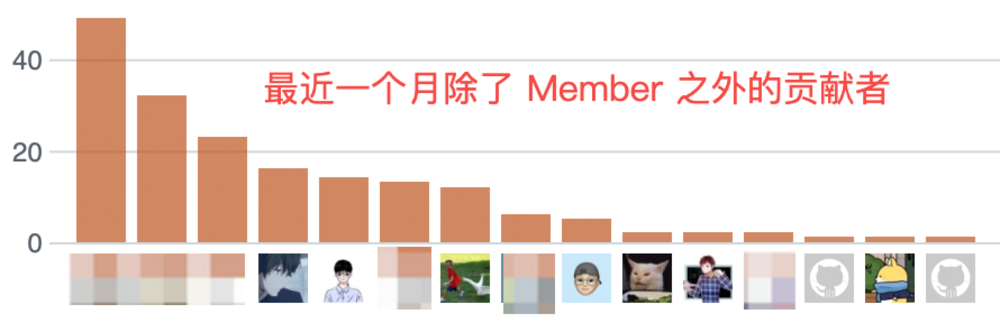



欢迎三位 New Member：

- 刘俊余
- 李鹤鹏
- 侯雪城



## 碎碎念

快七点半了，社区例会马上要开始了，临时想到这篇文章还没写，好紧张！

如果你这会看到了这篇文章，并且不在腾讯会议里，那么，还犹豫啥？赶紧的：[438-724-989](https://github.com/devstream-io/devstream/wiki/DevStream-Community-Meeting-No.3)

> 此处省略1万字，假装我已经写了很多。

**先看一幅图**

有些头像打码了。对。他们不重要。他们已经是 Member 了。

让我们把目光聚焦到前三个头像上：
- 忧郁少年
- 帅气少年
- 被鹅追着咬“沟子”的少年

你肯定以为我想强调他们提交的 Commits 数量都已经有十几个了。其实，不是。

难得可贵的其实是他们早已经把自己当作 DevStream 社区的一员，积极参与 issues 列表、微信群等渠道等问题交流，以主人翁的精神回答其他用户、New Contributor 的问题！主动思考如何将 DevStream 做的更好！这不就已经是事实上的 Member 了？

> 此处我应该找一些截图贴上的，但是，抱歉，来不及了。心中有图，无法截取，此处无图胜有图！

既然他们那么“不客气”，都拿 Member 的身份要求自己了，那我们又如何好意思不赶紧宣布（邀请、恳请、……）三位同学正式加入 DevStream Community，成为一个“认证”的 Member！

## 证书

对，有证书！

### 刘俊余

### 李鹤鹏

### 侯雪城

## 礼物

没错，有礼物，而且是升级版！对，升级版！比之前的 Member 礼物贵好几倍那种！

> 对，又没有图片，因为苦苦思考好几天，我们还没有选好应该送什么。

## 最后

恭喜各位同学正式成为 DevStream 开源社区的一员！开源的世界丰富多彩，在这里，你的所有付出都会被看见，都会被铭记！社区 Member 只是一个开始，希望你们持续参与开源社区，玩转开源，享受开源的乐趣！
