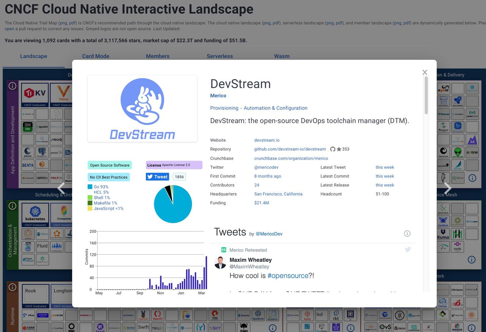



内部绝密聊天记录，请勿扩散！！！



**Echo Ma**：“话说 DevStream 用户群都三四百人了，似乎实际敲过 dtm 命令的不到10%啊？！”

**Daniel Hu**：“别瞎说大实话！”

**Echo Ma**：“你说有没有可能是他们用不来？”

**Daniel Hu**：“也可能是懒得尝试，抵触新事物。”

> (我总得找点借口吧)

**Echo Ma**：“你说有没有可能是 dtm 不好用？”

**Daniel Hu**：“不存在，不可能，我不信！dtm 是不够完美，但是你不能苛求一个小娃娃德智体美劳样样精
通！再说了，不好用，不好用你喊他们提 issue 去呀？有嫌弃的勇气，没有吐槽的胆量吗？不提 issue 
的抱怨我们当作没听见！”

**Echo Ma**：“有没有可能是用户找不到文档？”

**Daniel Hu**：“<docs.devstream.io>，我们的文档站点你没有宣传到位是不是？”

**Echo Ma**：“有没有可能是文档太枯燥？”

**Daniel Hu**：“想看欢快的内容，你喊他们去 <blog.devstream.io> 呀！是不是没告诉大家我们有博客站
点？”

>（俺们辛辛苦苦写了辣么辣么久，不允许有人不知道）

**Echo Ma**：“有没有可能，有些用户排斥文档？我没别的意思哈，可能就是部分用户，右脑更加发达，所以
更习惯看视频教程，就是那种稍稍有点不喜欢看文字内容的？”

**Echo Ma**：“你可以录一个视频不？”

**Daniel Hu**：“你觉得我很闲是不是？你见过哪个程序员写了代码还要自己录一个教程的？”

>（不是不想录啊，我的颜值不敢出镜啊）

**Echo Ma**：“如果用户想要。”

**Daniel Hu**：“用户赢了。等我半小时。”

>（不录脸吧，不能毁了用户心中我的帅哥形象）

**Daniel Hu**：“刷新下 <https://docs.devstream.io/en/latest/best-practices/gitops/>，他
们要的视频，插进去了。”

**Echo Ma**：“英文版视频呢？有些用户可能听不懂中文。”

**Daniel Hu**：“得寸进尺？不，英文版可以有，你找铁心去，他录英文和录着玩一样，10分钟就搞定了。”

>（反正不是我录）

**Echo Ma**：“铁心，英文版，占你十分钟不过分吧？”

**Tiexin Guo**：“十分钟，看不起谁呢”

>（五分钟后）

**Tiexin Guo**：“你刷新一下上面那个链接，英文版也有了，录个视频5分钟足矣。”

**Tiexin Guo**：“你们知不知道 DevStream 已经加入 CNCF landscape 了？”

>（满足而又奸诈地笑）

**Echo Ma**：“什么是 landscape？”

>（一脸疑惑）

**Daniel Hu**：“啥啥啥，快给链接，我要去发朋友圈！！！”

>（开始幻想朋友圈的100个赞）

**Tiexin Guo**：“<https://landscape.cncf.io/?selected=dev-stream>”

**Tiexin Guo**：“我再给你们截个图”

**Daniel Hu**：“我了个乖乖，老霸气了！”

**Daniel Hu**：“有点小失望，似乎点赞人数没有到100，不给力哦不给力～”

**Daniel Hu**：“不行，再把二维码放出去一次！让更多的人进群！让更多的人加我微信！下次发朋友圈，我
一定要凑够100个赞！”

**Echo Ma**：“好吧，你要的二维码，拿去。”

