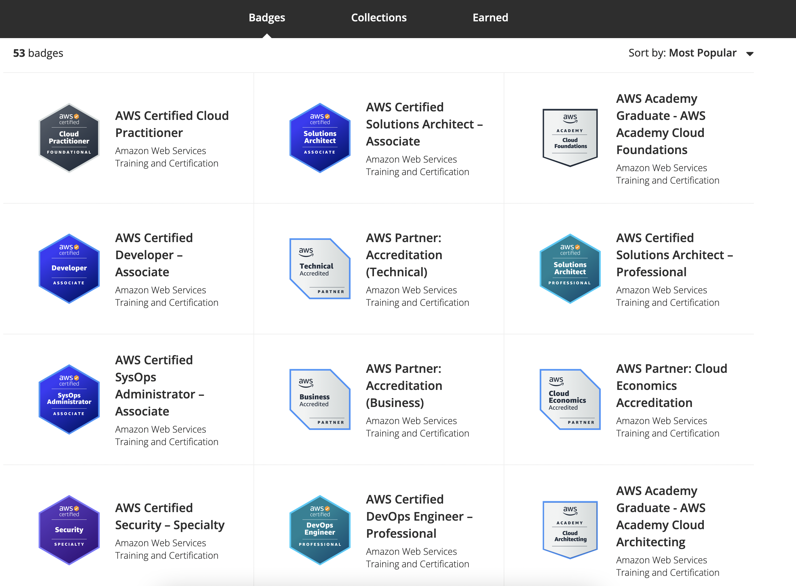
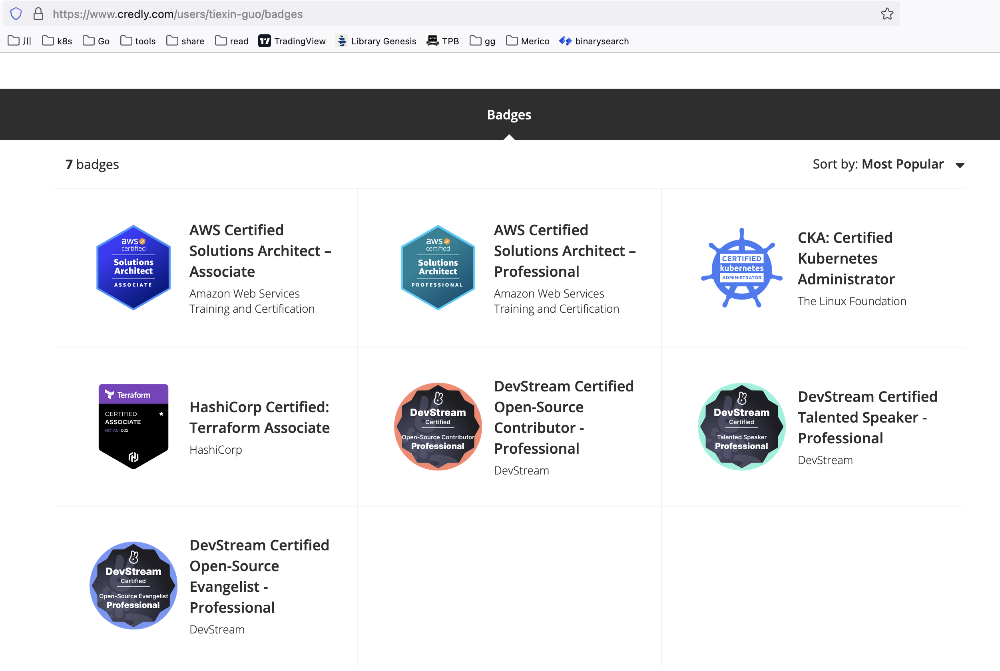
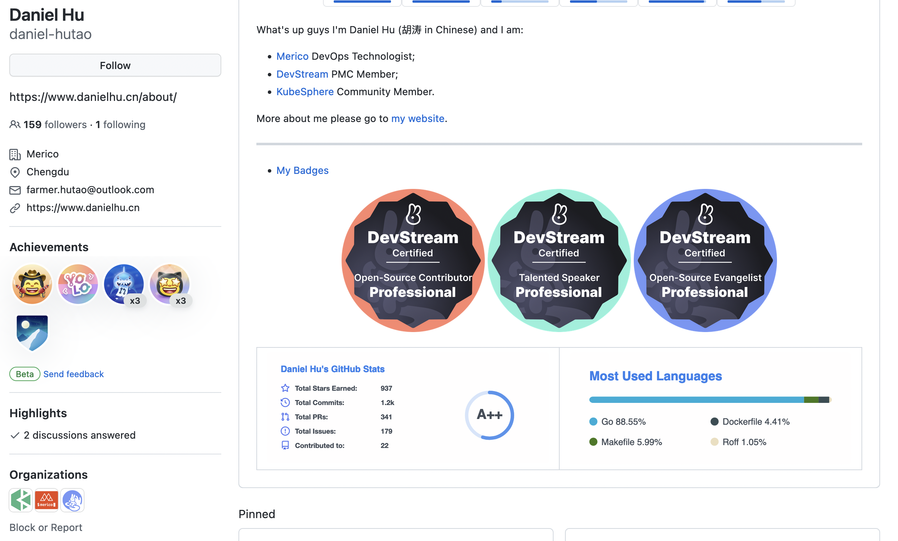
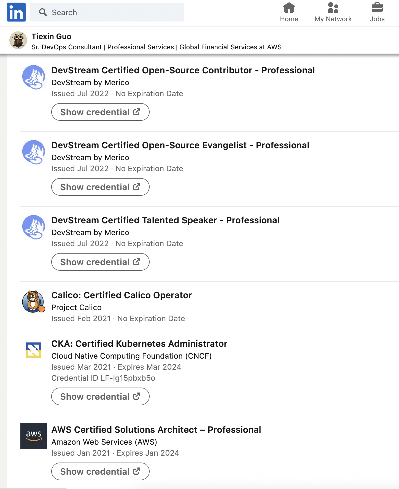

Hello, and welcome to another DevStream blog post!

In today's post, DevStream is happy to announce the new certification program for our contributors!

---

## 0 Background

For veteran contributors dating back to the beginning of this year, I'm sure you still remember our original certification, which is a well-designed digital image that certifies your efforts in the open-source community.

As beautiful as it is, there are some drawbacks with a certification in the form of digital images. To name a few:

1. The image is pretty big, making it hard to share on social media platforms.
2. Since it's an image, it's not so easy to embed it in your profile page, for example, LinkedIn profile, GitHub profile, or even inside your CV.
3. It's not easy for others to verify the authenticity of the certification.
4. Others don't know much about what you did to get that achievement, what skills you already mastered.

---

## 1 Introducing the New Digital Certification Program

With those pain points in mind, we sought out a new form of credential/certification system that would address those very drawbacks, and it wasn't long before we got ourselves an answer: Credly.

TL;DR: Credly helps issue digital badges.

OK, that was brutally brief, isn't it? So, let's read the long version:

---

## 2 [The Credly Story](https://info.credly.com/about-us)

> Credly was founded to help people connect their verified abilities to opportunities. And, we strive to bring equity and access to every member of the current and future workforce. After leading the transformation in how people learn and connect online, our team turned its sights on bringing innovation to the outputs of meaningful learning experiences: the credential itself.
> 
> In 2018, Credly acquired the Acclaim credential business from Pearson and became the most comprehensive global solution for recognizing skills, capabilities, and achievements. Pearson invested in Credly’s growth and in 2022, acquired Credly to provide powerful solutions in the global workforce learning and talent market.
> 
> Credly is leading the digital credential movement, making talent more visible and opportunity more accessible.

Credly works with leading organizations that share our focus on unleashing the potential of the workforce with digital credentials.

---

## 3 Why Did DevStream Go with Credly

No brainer: it seems [95% of the top IT certifications are issued through the Credly network](https://learn.credly.com/blog/your-brand-doesn-t-need-to-white-label-digital-credentials).

Plus, I got to know Credly because [AWS uses Credly for its certifications](https://www.credly.com/organizations/amazon-web-services/badges). Have a quick look at this beautiful wall of AWS certifications you can get:

Checkout [my profile](https://www.credly.com/users/tiexin-guo/badges) on Credly:

---

## 4 Wait a Minute. So I Got My Certs. Where Can I Show Them Off?

GitHub profile:

LinkedIn profile:

Tweet all you want, and DevStream will try our best to retreat your tweets!

Spoil alert: DevStream is redesigning our [community page on our official website](https://www.devstream.io/community/). I know, I know, it looks ugly; for now. It will be pretty, soon. You have my words. Contributors and their certifications will show up on the community page. Think of it as a "wall of fame" of DevStream. How cool is that!

---

## 5 Where Do We Go From Here

### Earn

We will issue a digital badge (and we will try to automate the process) when you earn a DevStream certification. Digital badges are active as long as your certification is valid.

### Claim

You’ll get an email from Credly’s platform with instructions for claiming your badge. 

### Share

Use Credly’s platform sharing features to post on your social media newsfeeds and add your digital badge to your professional profile, as mentioned above.
