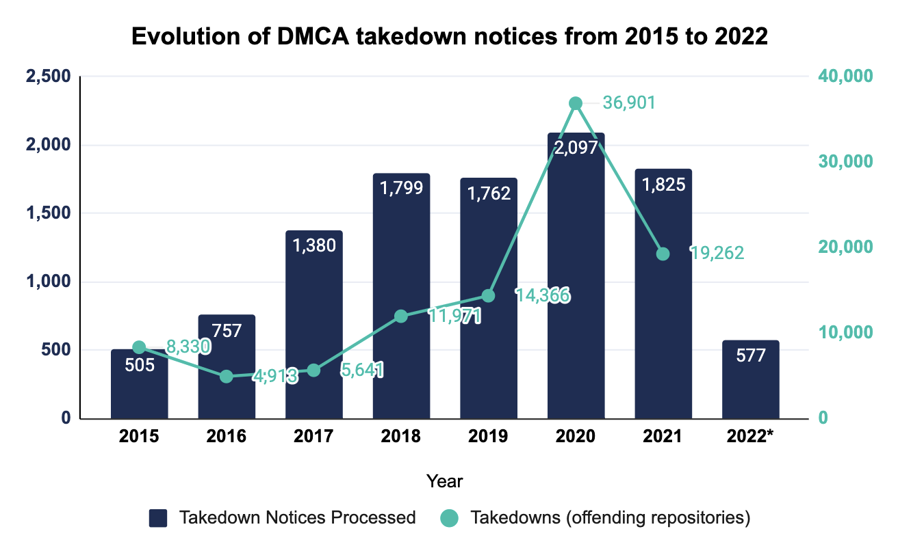


This article is orignally published at [GitGuardian Blog](https://blog.gitguardian.com/dmca-takedowns/).


## What is DMCA?

The DMCA is short for the **Digital Millennium Copyright Act**.

On Oct 12, 1998, the US Congress passed the DMCA, which amended U.S. copyright law to address important issues of the relationship between copyright and the internet.

It was signed into law by President Clinton on Oct 28, 1998.

---

## What Exactly Does It Mean?

I know, the term "DMCA" doesn't mean much to many readers, myself included.

Even if you read the full name, the Digital Millennium Copyright Act, it doesn't give a whole lot more information.

To understand the DMCA, it's perhaps easier to imagine a scenario where there wasn't DMCA:

> Let's say you created an online service that allows users to publish up to 140 characters of content they wrote; or a service where users upload video clips they created. Sounds familiar, right? I know; bear with me. Your service got popular and a lot of users decided to publish content on your platform. One day, a user copy-pasted some copyrighted work and published it on your platform under his name. If the owner of that copyrighted work sues you, **you are done**.

It's not easy for the owner to find the user who actually posted that content, but it's easy to find you since you are the **service provider**, not a random person around the globe. So, it's easier to just sue you instead since you are the service provider and you should be responsible for your users. Although it's not exactly YOU who published that copyrighted work, **your platform stores and serves it**. You can't argue with that. You won't get out of it easily.

You know, one single copyright infringement can cost you up to $150,000.

Now you see where I'm going with this: if there are hundreds or even thousands of infringements, you are doomed. You'd close down in a blink of an eye.

Since the possibility of being held liable for user-generated content could be very harmful to service providers, who dare to provide those services?

---

## A Story of the LLC

If the scenario above doesn't resonate with you very much, think about the limited liability company (LLC.)

In the case of limited liability companies, the liability of members to contribute to the debts of the company is limited to the amount of their investment in the company and does not extend to personal assets.

Before LLC, if you were a car company and your customers had accidents and sued you, you'd be held with unlimited reliabilities. If your company couldn't pay the penalties, you must. You'd be personally broke, too; you and your company would be in an irrelevant place in the car market from which you would never return.

Had not been for the LLC, nobody would create companies to make cars. The invention of the LLC has greatly encouraged people to innovate, create, and build. It has boomed the development of business, and even the history of humankind.

What if there is a similar way to encourage online business providers, by limiting their liabilities and protecting their interests?

---

## How DMCA works?

The DMCA provides a "safe harbor" for service providers that host user-generated content.

How did it achieve this?

### Notice and Takedown

The DMCA has a "notice-and-takedown" rule: as an online service provider of user-generated content, you have to provide a mechanism/system to allow copyright owners to notify you about your users' infringing material so that actions can be taken to take down those infringing material.

There should be two simple, straightforward procedures that all users should know about:

- a takedown-notice procedure for copyright holders to request that content be removed
- a counter-notice procedure for users to get content re-enabled when content is taken down by mistake or misidentification.

Essentially, as the service provider, as long as you play with the DMCA's notice-and-takedown rule, **you are protected**. You won't be liable for copyright infringement based on user-generated content.

And this is exactly the DMCA's principal innovation in the copyright field. Just like the invention of the limited liability company, the DMCA encourages you to innovate and create services and platforms to host user-generated content, so long as you play with the rules.

The DMCA framework is a bit like passing notes in class. The copyright owner hands the service provider a complaint about a user. If it's written correctly, the service provider will pass the complaint along to the user. If the user disputes the complaint, they can pass a note back saying so.

### DRM/TPM Circumvention

The DMCA criminalizes the production and dissemination of technology, devices, or services intended to circumvent measures that control access to copyrighted works (commonly known as Digital Rights Management, or DRM).

The DMCA also prohibits circumventing technological protection measures (or TPMs) used by copyright owners to control access to their works.

For example, it's unlawful to bypass a password system used to prevent unauthorized access to a streaming service.

With the background information in mind, now let's look at one of the most famous (if not the most famous) DMCA takedown case.

---

## DMCA takedown notices on GitHub

GitHub hosts a [special repository](https://blog.gitguardian.com/dmca-takedowns/https) containing all the DMCA takedown notices and counter-notices they've received over the years. It's a great source of statistics to keep an eye on the evolution of this.

For instance, we know from that repo that **GitHub took down 19K repositories following a DMCA notice in 2021** alone.

[Source](https://github.com/github/dmca)

The main lesson from this publicly available data is that DMCA takedowns **are much more common than we think**: 1 in 10,000 repositories is subject to a DMCA notice for example.

---

## A Case Study:  the `youtube-dl` DMCA Takedown

`youtube-dl` is a free and open-source download manager for video and audio from YouTube and over 1,000 other video hosting websites.

### The Story

On October 23, 2020, the Recording Industry Association of America (RIAA) issued a takedown notice to GitHub under the DMCA, requesting the removal of `youtube-dl` and 17 public forks of the project.

> The RIAA request argued that `youtube-dl` violates the Section 1201 anti-circumvention provisions of the DMCA, and provisions of German copyright law since it circumvents a "rolling cipher" used by YouTube to generate the URL for the video file itself (which the RIAA has considered to be an effective technical protection measure, since it is "intended to inhibit direct access to the underlying YouTube video files, thereby preventing or inhibiting the downloading, copying, or distribution of the video files") and that its documentation expressly encouraged its use with copyrighted media by listing music videos by RIAA-represented artists as examples. GitHub initially complied with the request.

After that, many users criticized the takedown, noting the legitimate uses for the application, including downloading video content released under open licensing schemes or creating derivative works falling under fair use (such as for archival and news reporting purposes).

And, some users reposted the software's source code across the internet in multiple formats. For one interesting example, users posted images on Twitter containing the whole `youtube-dl` source code encoded in different colors on each pixel.

GitHub users also filed pull requests to GitHub's repository of DMCA takedown notices that included `youtube-dl` source code.

### Takedowns

The original takedown of `youtube-dl` was a mistake, but it wasn't simple as that. There are two main types of DMCA takedowns:

- based on copyrighted work;
- based on DRM/TPM circumvention.

If you google "DMCA takedowns", there are actually many famous incidents, most of which are related to copyrighted content infringements. However, the "designed to circumvent a TPM" type is exceedingly rare.

In fact, less than two percent of the DMCA takedowns GitHub processed are based on circumvention claims, and of those two percent, the `youtube-dl` incident was a particularly unusual case.

The claims based on circumvention are often highly technical in nature, so it's hard to get it right especially when there aren't that many cases. People make mistakes; that's what makes us human.

It's worth noting that although the DRM circumvention-based takedowns are far fewer, DMCA takedown claims based on circumvention are a growing, industry-wide issue for developers with far-reaching implications.

### Reinstated

On November 16, 2020, GitHub publicly reinstated the repository.

The Electronic Frontier Foundation sent GitHub a document, contesting the takedown notice. It clarified that the software wasn't actually capable of breaching commercial DRM systems.

In response, GitHub also announced that future takedown claims under DRM/TPM-related sections would be manually scrutinized on a case-by-case basis by legal and technical experts.

### Bottom Line

The `youtube-d` story is an interesting case where the takedown claim was rejected because it didn't circumvent DRM protection nor any copyrights itself.

Unfortunately, this is not representative of the reality: as shown earlier, many takedown requests are indeed valid, making copyright infringement a growing problem on GitHub.

To help companies identify potential **source code leaks**, GitGuardian has made available a free tool, [HasMyCodeLeaked](https://hasmycodeleaked.gitguardian.com/), that can perform an exact lookup of code "fingerprints" in GitHub's public history. Identifying repositories at high risk of copyright infringement and carrying out preliminary investigation before deciding whether to file a DMCA takedown notice on GitHub.

---

## Summary

After reading this article, I hope you would have a better understanding of what DMCA is and why it's important to the user-generated content world. If you like this article, please like, comment, and subscribe. See you in the next one!
