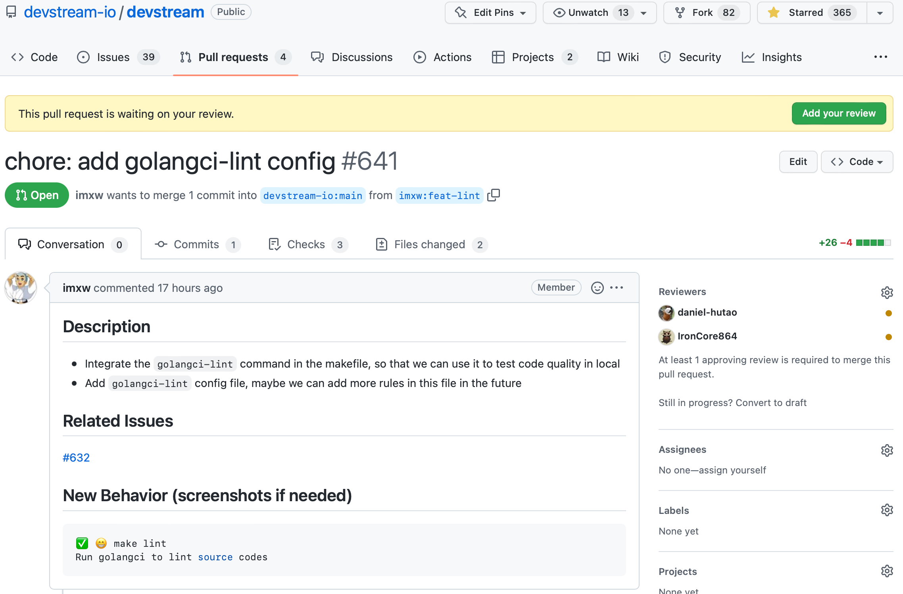
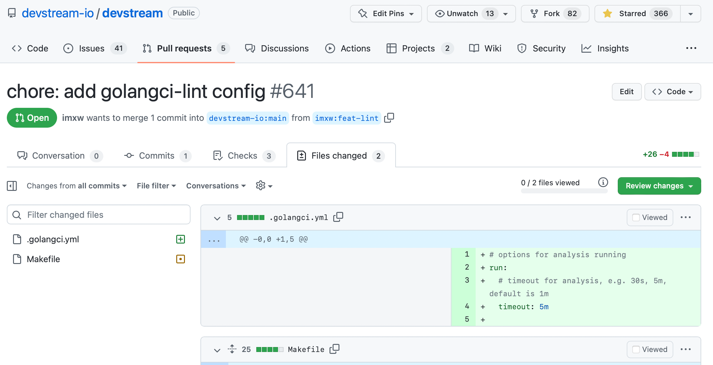
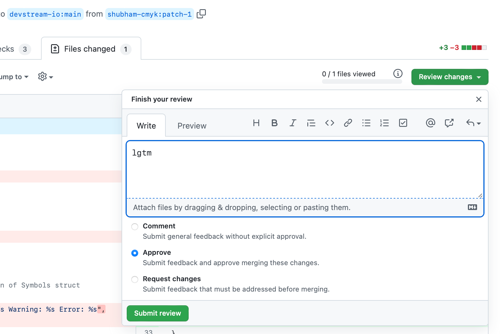
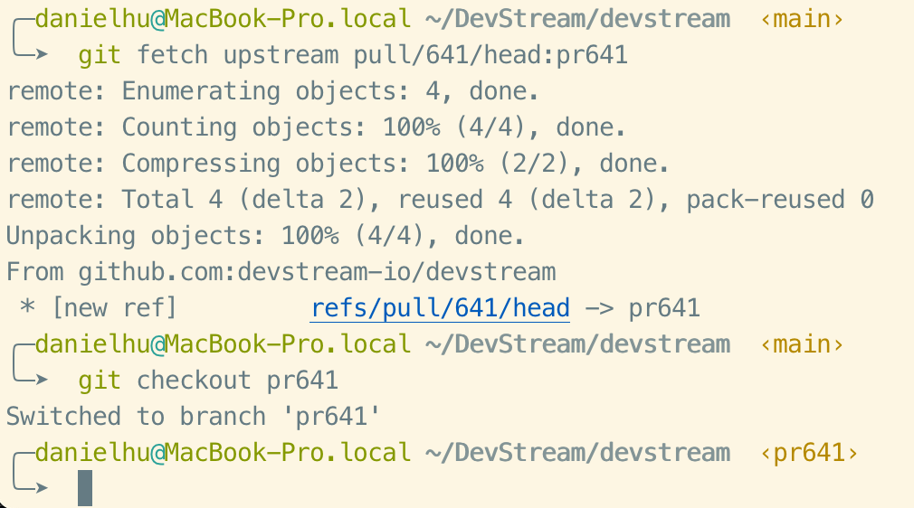
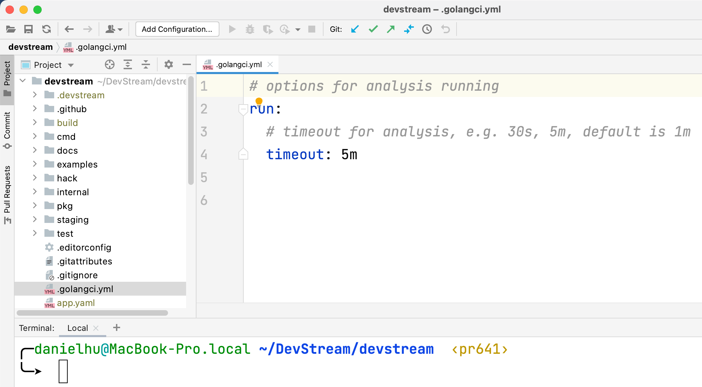
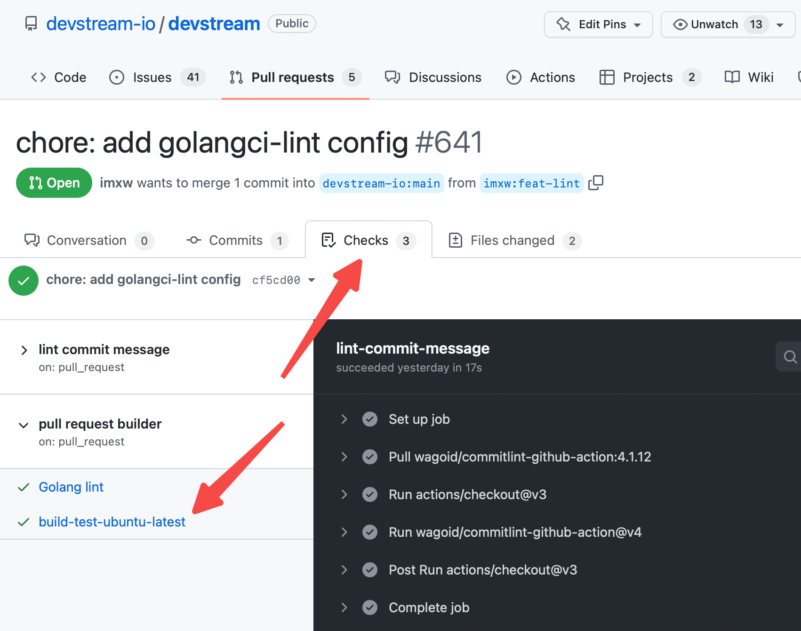
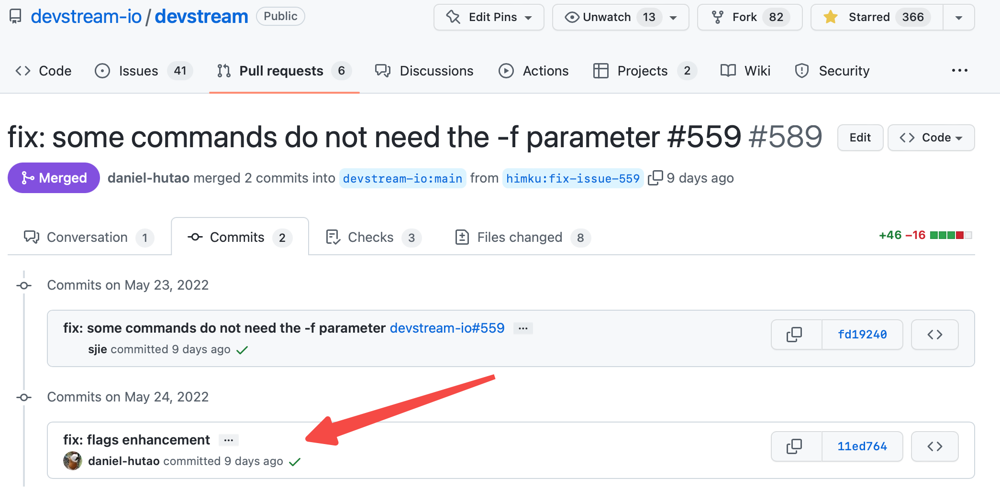
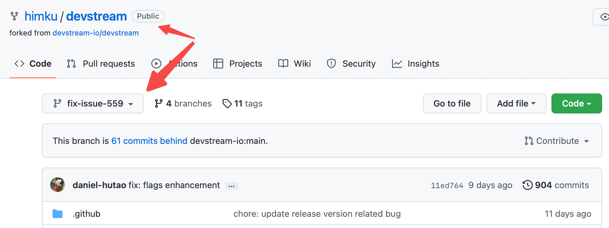

This is [Tiexin Guo](https://www.guotiexin.com/), [DevStream](https://github.com/devstream-io/devstream) [PMC](https://github.com/orgs/devstream-io/teams/pmc) Chair (an open-source DevOps project with an enthusiastic community.)

And today, we are going to talk about code review.

Specifically, we are going to talk about:

- why do we need to do code reviews
- how to review;
- how to do code review on GitHub
- how to review for open-source projects

But if you want to get acquainted with some best practices for reviewing code of any kind (closed-source projects, on GitLab, etc.,) please do read on, because the principles and methodologies are universal.

Without further adieu, let's get started.

---

## 1 Why Do We Need to Do Code Review?

I know you might already have a question in your head even before reading the title of this post: why do we need to do a code review?

An excellent question, indeed. Because once you feed the code into a compiler, the result will always be the same. Why on earth do we need to bother reviewing code and writing clean code, anyway?

Because code is for humans to read, not for machines to run.

"Clean or not" makes no difference to a machine, but it makes all the difference for humankind. Cleaner code is much easier to organize, refactor, add new features into, debug, to ...

Adding a new feature into a bad codebase could easily cost 100x the time compared to a clean codebase. If it's possible at all.


So, the answer is easy: code review is for code quality.

---

## 2 Why Not Using Tools and Automation for Code Quality?

There are already a bunch of tools or third-party services which can help you to evaluate the quality of a piece of code (don't ask me how I knew this.)

For example, GitHub already showed how many lines of code changes there are in a PR. There are tools to tell you what is a "big" function, a "large" file; how many "big" functions and "large" files you've got in your repo; their percentage; etc.

But hey, you can invent a million metrics, and they are still only "indicators" of code quality; they don't "define" good code.

For example, in my previous company, we used an in-house tool that would check if the length of a function exceeds 50 lines of code. Why 50? why not 40, or 60? If it's 51, is it "clean"? If not, how about I delete a necessary empty line intended for separating two blocks? How about I delete a necessary comment?

No metric is perfect, and there are a bunch of ways to hack it and bypass it.

The only golden standard of code quality is for humans to review. Because code is meant to be read by humans.


---

## 3 Code Review: What Are the Standards?

Once we've figured out why we need to do it, we need to answer this not-so-technical question: what kind of code needs to be refactored? What kind of code needs to be rewritten? What can be merged? Anyway, what standard should I use?

I know what you are thinking, and you are right: for code with obvious bugs and errors, you can't merge'em. This isn't in the scope of our discussion.

How about code that runs properly, does what needs to be done, but has a few "defects," like "missing necessary comments," or "not easy to read/understand?"

### 3.1 New Contributors

I'd like to make it clear: for new contributors, it's absolutely fine if they didn't meet your standard (in the beginning.)

For new contributors, it's key to let them feel they are welcome, and there isn't much that hinders their contribution. Easy to understand: if it's extremely difficult to contribute, they won't. So, the thing is: don't let new contributors feel frustrated. We need to make the process as welcoming as possible for newcomers. Nothing is more important than letting new contributors feel easy and welcome.

But, this isn't to say that we tolerate "dirty" code. If a new contributor made a commit that isn't perfect to your standard, guiding them and helping them to learn is the best way, and we should do it encouragingly. They will learn and next time they won't make the same mistakes again. We can even lead by examples, and give them sample code snippets, or even create another improvement commit and let them know.

### 3.2 Senior Members

For senior contributors and members, we intend to keep the quality high.

It's not enough if a PR merely does what it's supposed to. The readability should be fine, too. Evidently, a quick review reduces the time of code review and we could release a new feature quickly, but in the long run, careless reviews would give us a run for our money: as code quality decreases, it would take longer and longer to do even the most simple task.

To sum up, we should:
- keep it simple and welcoming for new contributors;
- keep the bar high for ourselves, core developers, and community members.

---

## 4 Working in an Open-Source Project

Last month, 3 more contributors joined the DevStream community. Circled (or to be precise, rectangulared) in red:


Now, we have seven active members in total. Plus, we've also got c.a. 20 external contributors. Yep, that's not a typo; you read it right: we've got more than 20 contributors, already.

As a leader in an open-source project, it's not easy managing an open-source project, coding, reviewing all those pull requests (PR) from the community every day, AND still having a life (don't ask me how I knew this.)

I guess this isn't uncommon for many project leads. Yes, you need to manage priorities properly and get things done, but there is a line when you simply have too many things to do and can't finish them all.

Time to have a "reviewers" group and start "group" reviews! Simple answer, isn't it?

But how?

What's the process? What's the standard? Any tricks to speed it up while keeping the quality high in the air? A million questions to be answered.

OK, let's try to tackle some of the important ones in this blog post.

---

## 5 Taking up a Code Review Task

Let's do a code review, now.

Before start reviewing anything, let's accept a quest first.

Why do we need to do this? I'm glad you asked.

The open-source community works asynchronously. That is to say, they don't do too much live communication, like phone calls, video meetings, or even offline, face-to-face meetings. Instead, they rely heavily on messages (by using instant message tools, but probably not reading them instantly) and emails. You need to let other people know that you are on this task so that others won't do the same thing. 

Even if you are not in an open-source project, for example, in a closed-source, internal project with a team sitting together around the table, it's also nice to let others know that "hey guys, I'll work on this, please don't do duplicated work."

OK, then how to mark a task as yours?

If you are already the reviewer of a PR, the "Reviewers" section will show your avatar, and there will be some hint in the yellow bar saying that "_This pull request is waiting on your review._" There is also a green button "_Add your review_." Click this button to start a reviewing process.



Then how to become a "reviewer"?

Easy question (and not easy at the same time:)

Since you are a reviewer, you have permission to click the gear "⚙️" icon to assign a reviewer (for example, yourself.) But if you are not a legit reviewer yet, you should become a reviewer first.

---

## 6 GitHub Code Review Walk-Through

Click the "_Add your review_" button and we will be directed to the Code Review page:



Here, we have a few features worth exploring:
- the "file tree" on the left
- file filter
- the "Viewed" checkbox for each file
- the "..." button

Once you've gotten familiar with all of those quirks and features, your code review life quality will be greatly improved.

To read more details about these, check out the [official doc here](https://docs.github.com/en/pull-requests/collaborating-with-pull-requests/reviewing-changes-in-pull-requests/reviewing-proposed-changes-in-a-pull-request). Explore on. I'll wait for you to finish that doc first.

For simple code changes, it's more than enough to view the code diff on the code review web page. Example:


We could easily tell if this change makes sense or not (hint: No. Missing comma. Try to find it :) If it's fixed, we can approve it:



---

## 7 Reviewing a PR Locally

For more complicated PRs, if the author also didn't include any screenshot of the test they had run ([see this example here](https://github.com/devstream-io/devstream/pull/405),） it's better to check out the code locally and review it with the help of an [IDE](https://en.wikipedia.org/wiki/Integrated_development_environment).

Take this PR for example: [pr #641](https://github.com/devstream-io/devstream/pull/641). To download this PR locally, let's execute:

```sh
git fetch upstream pull/641/head:pr641
git checkout pr641
```

Results:



Then we simply start our IDE and read the code there:



In IDE, it's much easier to spot possible mistakes (like missing a comma.) And, you can also build, test, and run it locally to see if it passes the unit tests and even integration tests.

You might think this is redundant because a PR might have triggered a CI process already: 



But hey, not all CI workflows are born equally. For example, not all CI workflows would run integration tests. So, testing a PR locally is still necessary for bigger PRs and for more complicated changes, to do a quick regression.

So far, you can fully understand what a PR has changed.

---

## 8 Committing to Somebody Else's PR

A general rule of thumb: don't.

If you want to do it very badly, rethink your intention. Ask yourself: do you have to do this?

Normally, it's not recommended to commit to other people's work directly. It's not respectful to the original author, and it's complicated (especially if the original author needs to add another commit.)

But, rules are to be broken. Like every other single rule in the world, there are exceptions to this rule.

Taking [this PR](https://github.com/devstream-io/devstream/pull/589) for an example:

It's from a new contributor. We don't want to make "contributing to the project" too hard, which would shut the door and scare too many potential contributors away.

Plus, this PR isn't simple enough to get it 100% right. It seems easy, but to make it perfect, you'd need to know all `dtm` sub-commands, which certainly is a high bar to cross for a first-time contributor.

That's why we added another commit to improve his work (important: and also let him know about it,) and included the test result:



How to do this exactly?

1. Local Commit

Make changes, then commit:

```sh
git add xxx
git commit -m "bug: yyy"
```

2. Find the PR Source Branch

We can find out from which branch this PR comes from:


Now we see the "fork" info, like:



Then we can add a new remote:

```sh
git remote add himku git@github.com:himku/devstream.git
```

- remote: `himku`(git@github.com:himku/devstream.git)
- branch: `fix-issue-559`

Then we push to it:

```sh
git push himku HEAD:fix-issue-559
```


Cool, right? But again: rethink before you want to do this; because more often than not, you don't necessarily want to do it.

---

## 9 Summary

Read more if you are interested:
- Google's [Code Review Developer Guide](https://google.github.io/eng-practices/review/)

If you like this article, please bookmark our DevStream blog and my personal blog. We are also on Medium and Dev.to. Here are the links for you:
- DevStream blog: https://blog.devstream.io
- Tiexin's blog: https://www.guotiexin.com
- DevStream Medium: https://medium.com/devstream
- Tiexin's Medium: https://medium.com/@IronCore864
- DevStream Dev.to: https://dev.to/devstream
- Tiexin's Dev.to: https://dev.to/ironcore864/

See you in the next article.
