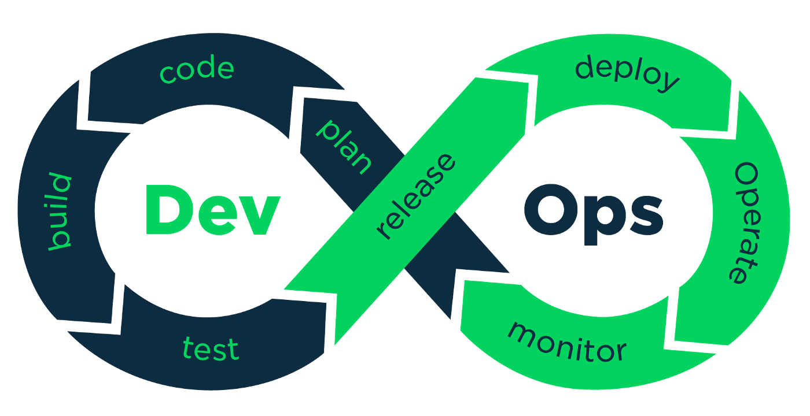

> Note: opinions are my own. They don't represent my current company or any previous companies I've worked for.

> Note 2: recently, my colleague published a blog post (in Chinese, [here's the link](https://blog.devstream.io/posts/%E5%BD%93%E6%88%91%E4%BB%AC%E5%9C%A8%E8%AF%B4devops-sre%E6%97%B6-%E6%88%91%E4%BB%AC%E5%9C%A8%E8%AF%B4%E4%BB%80%E4%B9%88/) if you are interested). I like this post, but I'd like to share more with you on the topic of DevOps. So I decided to publish a miniseries (7 episodes planned) on DevOps. Here's the first article.

> Note 3: this article is originally published on Jan 14, 2021, on Medium in [my DevOps Chat publication named 4th Coffee](https://medium.com/4th-coffee/). See it [here](https://medium.com/4th-coffee/on-devops-1-what-it-is-549bc4e6b1ed) if you are interested. This post is edited again on May 10th, 2022.

## Background

I’ve been working as a DevOps engineer since 2016, and as of today in 2022, I'm still working on it (as the PMC of [DevStream](https://github.com/devstream-io/devstream)). In 2021, I was lucky enough to join AWS as a Senior (L6) DevOps (already left, though). But this article doesn’t represent AWS’s view; nor does it represent my current corporate view. It’s my personal opinion, which I learned and formulated over the years of hands-on experience in projects.

In the beginning of 2021, I had the chance to talk on the DevOps topic — what it is, why we need it, and how to measure if we are doing it well or not. So I thought I should take that opportunity, form my thoughts into words, and share them with the community.

In my professional career, I’ve worked in different businesses, including university research, search engine, government, internet, enterprise software, mobile, marketing business intelligence, logistics, automotive, pharmaceutical, insurance, consulting, etc.; and I’ve worked in different types of companies and projects: state-owned company, local internet giant, global IT enterprise, foreign start-ups, global traditional organizations, etc. And I have to say that I have learned and grown a lot during this great journey both as a person and as an engineer (full stack developer and DevOps engineer). I also attended a few conferences and meet-ups and even gave some talks in them, but I have never got the chance to summarize what I do and share the knowledge with a bigger audience, and that’s the reason I wanted to start this series.

## What is DevOps?

Let Me Tell You a Story First.

I have interviewed over 200 engineers in the past 3 years, and sometimes I’d like to ask this question. It’s probably meaningless; I only asked it because I want to see what it means to everybody.

And in all the answers I got, it seems most people always start with this sentence: “that’s a good question.” Then the person starts to explain his thoughts.

I’m not a native English speaker, but over the years, I’ve been gradually learning the fact that “that’s a good question” equals “I don’t know.”

It’s a meaningless filler phrase to fill the awkward silence during conversations, and it buys you some time to organize your thought before you answer the question.

Only on infrequent occasions would you hear this sentence because you really had asked an excellent question.

I have also interviewed (as an interviewee) many companies over the last 5 years, both start-ups and large corporations. I also got asked about this quite often, at least more often than I had anticipated. Sometimes, during the conversation, you started to realize that the person or the company who asked this question didn’t really know the answer either; they asked this because they wanted to learn from you and see what new ideas you can bring to the team.

## Why Is It So Hard to Define DevOps?

Why is this question hard to answer?

Because, in my opinion, DevOps is a lot.

## Let’s Try to Figure It out

Let me quote some definitions first before we discuss DevOps.

Here I quote three definitions, and they are from Wikipedia (because it’s like an internet dictionary), AWS (because we all hear that AWS does good DevOps), and Atlassian (because as a DevOps, we probably use their tools a lot so they might know a thing or two):

Wikipedia:

> DevOps is a set of practices that combines [software development](https://en.wikipedia.org/wiki/Software_development) (Dev) and [IT operations](https://en.wikipedia.org/wiki/IT_operations) (Ops). It aims to shorten the [systems development life cycle](https://en.wikipedia.org/wiki/Systems_development_life_cycle) and provide [continuous delivery](https://en.wikipedia.org/wiki/Continuous_delivery) with high [software quality](https://en.wikipedia.org/wiki/Software_quality).[[1]](https://en.wikipedia.org/wiki/DevOps#cite_note-Mala_2019_p._16-1)[[2]](https://en.wikipedia.org/wiki/DevOps#cite_note-loukides-2012-2) DevOps is complementary with [agile software development](https://en.wikipedia.org/wiki/Agile_software_development); several DevOps aspects came from Agile methodology.

(I know, there are a lot of links. You don't have to read all of them, but it's recommended.)

AWS:

> DevOps is the combination of cultural philosophies, practices, and tools that increases an organization’s ability to deliver applications and services at high velocity: evolving and improving products at a faster pace than organizations using traditional software development and infrastructure management processes. This speed enables organizations to better serve their customers and compete more effectively in the market.

Atlassian:

> DevOps is a set of practices that works to automate and integrate the processes between software development and IT teams, so they can build, test, and release software faster and more reliably.

It seems there are some similarities, which are:

- _practices_
- _velocity_

And there are differences, of course, and let’s see them one by one:

## A Combination of Dev and Ops

Wikipedia says it’s a combination of Dev and Ops.

This basically says nothing because even if I knew nothing about this subject, I had already known from the word itself that it combines Dev and Ops.

An excellent question here is: is DevOps really Dev + Ops?

Yes, and No.

Yes, because you would need the skillsets from both Dev and Ops.

No, because simply putting two teams together wouldn’t get you there.

## Cultural Philosophies

What AWS’s definition has and others don’t have, is the “cultural philosophies,” and I like it.

Let’s say you have the tools and skillsets from both Dev and Ops. Would that be enough to enable you to achieve higher velocity?

Probably not.

The fact is, you already have Dev and Ops teams and the corresponding skillsets in your org. Then you pick up a new CI tool that is famous in the DevOps world. Would you be able to deliver faster already?

I don’t think so.

This is because how we do things is more important than what we have, and by definition, “how we do things” is the cultural part.

## Culture

Culture is how human societies behave. What the customs are, what the norms are.

For example:

- What is right, what is wrong?
- What is acceptable, and what isn’t?
- How do you learn?
- And more importantly, how do you encourage the team to learn?

Culture can be highly technical. For example: how do you do code review? What types of code are acceptable, and what are not?

And it can also be highly nontechnical. For example: what standards do we use for hiring and promoting?

## DevOps Culture

Then, what exactly is the DevOps culture?

You probably see this image (or something very similar to this) a lot. And to be honest, the DevOps culture is hidden in this picture:

You don’t separate Dev and Ops. You have a shared understanding and shared responsibility. You take up the responsibility as a whole through collaboration and communication. And this is the cornerstone of the DevOps culture.

## Is DevOps a role?

With the culture part explained, it’s easy to answer this question.

Yes, but no.

Yes, because companies create job titles like this.

No, because companies that created the job titles like this only put Ops in the DevOps team in many cases.

It’s not really a job role. It’s more of a culture, methodologies, and mindset to do things. Putting teams together and throwing in some new tools won’t give you DevOps.

## What is Required to Achieve the DevOps Culture?

Because we have shared understanding and shared responsibilities, traditional Dev needs to learn from Ops, and traditional Ops need to learn from Dev.

Because we have new practices and tools, everybody needs constant learning about methodologies and new technologies.

So, how to achieve a DevOps culture? At this point, this question can answer itself:

DevOps requires a “growth and continuous learning mindset” to succeed.

## How to Enable the Growth and Learning Mindset

Gartner, the globally leading research and advisory company, predicted in 2019 that by 2022, 75% of DevOps initiatives would fail to meet their expectations; this number grows to 90% by 2023.

Reason: limitations of management approaches used by leadership

Leadership support is one of the critical elements of its success.

## Motivation

Let me tell you another story that you probably will relate to:

I’ve worked in many start-up companies, and it seems many of those start-ups share a “start-up culture”: free breakfast, and free beer in the fridge.

The idea behind this is simple: by creating a more welcoming environment, they think employees will be more motivated.

Do I love free beer? Of course.

Will this really motivate me? No.

When I search for my next job position, I will not use “free beer in the fridge” as a standard. People who get paid at least 10k per month probably wouldn’t care if they can get 2 dollars worth of beer.

Having a free beer in the fridge won’t motivate your team to learn and grow continuously.

## What Motivates the Team to Grow

Technical people need 3 things to be motivated, and they are:

- Mastery
- Autonomy
- Purpose

The reasons are easy to understand:

When you have comprehensive knowledge or skill in a subject and have great accomplishments, you will be more motivated. It’s like that if you get more praise for your work in the school, you will be more determined to do it better next time.

The team learns fast and wants to do greater things. If they are constantly blocked and slowed down, especially by leadership, they lose their motivation. It’s like driving a Porsche sportscar at 50km/h. You have the best tool, but you can’t speed up. You wouldn’t enjoy driving like that, and you lose interest in driving over time.

The team needs to know why they are doing something. Because without a purpose, everything is just garbage.

## Leadership

Once we figured out the culture, and what motivates the team to implement the culture, it’s easy to figure out what we should seek in leadership: we need necessary behavioral characteristics that empower and encourage the team, rather than technical skillsets and expertise, for example, if the leader is a professional in the cloud or 12-factor app or what have you.

Leadership should encourage the team to learn fast, try fast, and fail fast because by embracing failure as a learning opportunity, you learn the fastest way.

Leadership should empower the team, and give the team enough autonomy to make decisions free of second-guessing. I’ve seen exactly the opposite cases very often, and the leadership doesn't even know they are discouraging the team.

Leadership should provide clear goals and key metrics as part of the motivation for the team’s continuous learning and growth mindset.

## IT Enables Business

If you go back to the beginning where I quoted AWS’s definition of DevOps, you will see that AWS mentions something that neither Wikipedia nor Atlassian mentioned:

> This speed enables organizations to better serve their customers and compete more effectively in the market.

Yes, all definitions mentioned DevOps' benefit being velocity, but only AWS explained why you need this velocity: to serve your customer.

I like it because, without this purpose, DevOps is just an empty gesture.

In modern days, more and more organizations start to realize that IT architecture not only serves the business because it’s a must-have but also enables more possibilities for new businesses and growth. And that’s where the DevOps’s benefit will bring you to.

## Summary

After this long discussion, it’s safe to try to make a definition of DevOps:

DevOps is a combination of:

- a shared responsibility model
- continuous growth and learning mindset
- skillsets from both Dev and Ops
- best practices
- modern toolchains

that increases velocity to deliver faster, get customer feedback faster, and adapt your product and service faster to serve your customers better.

In the next article or a few articles, I will discuss the benefits that DevOps brings.
