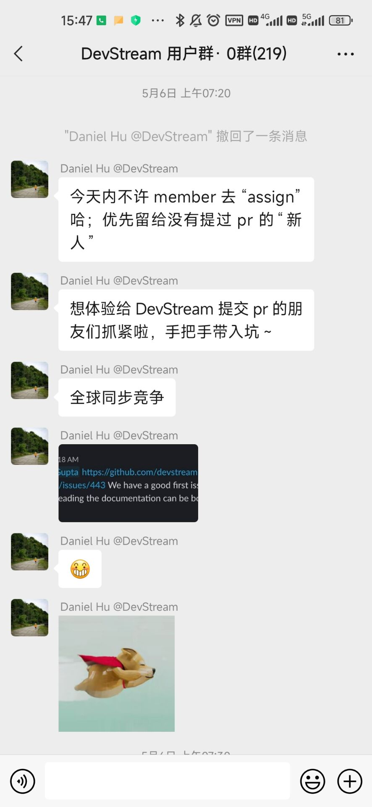
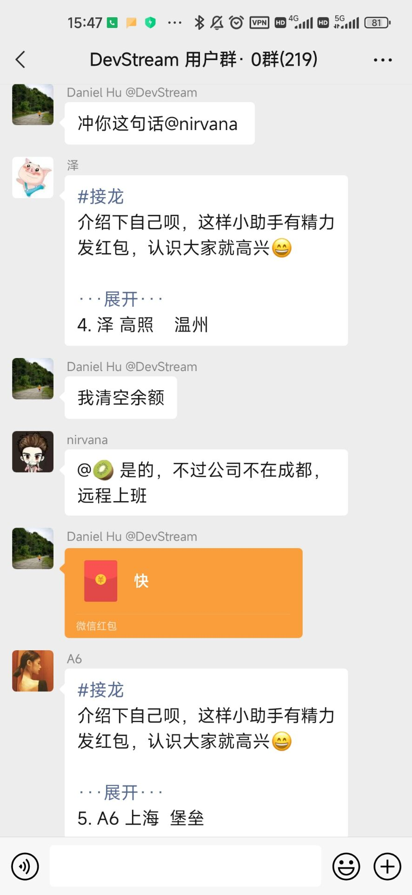
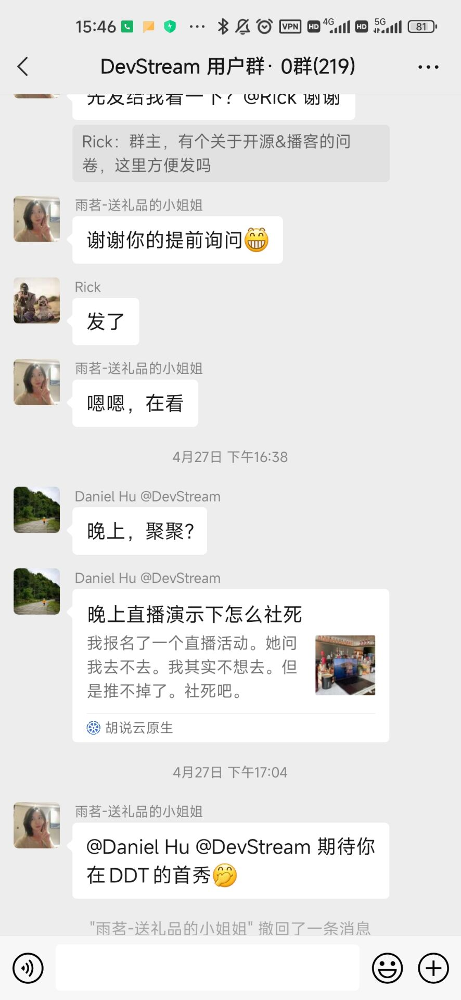
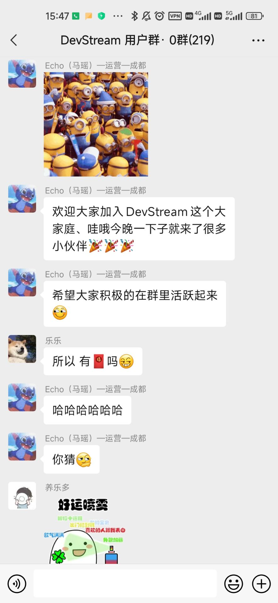

> 今天，我是来讲故事的，讲我和开源社区、和 [DevStream](https://www.devstream.io/) 的故事。

## 先讲点废话

有趣的故事，总是有些背景的，我也想讲一些。

### 首先我想讲讲，我理解的开源是什么

> 开源不是仅仅提供免费的软件，而是「**一群有梦想的人，一起打造一件艺术品。**」

### 为什么写这篇文章

我不是专门来给 DevStream 推销的，她没有因为我写这篇博客专门给我钱。

我想你在听了我的故事之后，除了明白我为什么选择 DevStream，还能从中收获一些其他有用的东西。比如，如何选择社区，如何参与一个社区。我还希望你能从中收获一些快乐。

> 我写这篇博客不出于物质回报，**仅仅只是想让我做的事情、我觉得有价值的东西被更多的人看到。而这正是开源、正是 DevStream 在做的事情。**

我喜欢技术的纯粹，大家并不带着强烈的物质上的目的来参与，所以也不会被此所牵绊，想什么时候参与就什么时候参与，想写多少就写多少。



**我们只是觉得，自己在做一件极度热爱且非常牛逼而且真的有用的事情。** 这就是我写博客以及DevStream甚至所有开源项目贡献者的动机。



## 相识

### 红娘

我和她相识于一场大型相亲活动——**开源之夏**。

这是一个双向利好的平台，各个开源社区可以报名吸引各大高校的学生人才参与社区，学生也能通过活动报名喜欢的社区/项目，提交申请书，从此走上开源的道路。



我不想刻意隐去这个活动的名字，哪怕这篇文章发布在 DevStream 的博客平台上。正是它带我走进了开源的世界，我不能忘恩负义，不想当渣男。



国内外类似的活动还有很多。正在听故事的你，可以直接参与 DevStream 作为第一个开源项目。如果不感兴趣也没关系，可以选择通过这样的开源活动认识更多的姑娘。

### 相遇

因为我的技术栈主要是 Go ，所以把偏爱会 Go 的男人的姑娘们都挑了出来。DevStream 也是其中之一，她还留了联系方式，贴了微信用户群二维码，我就加了进去。之后的一段日子里，项目还没发布，我就转去忙实验室的事情了。

她看起来很普通，见到她第一面的时候，她的官网还很朴素，几乎是素颜。star 也不多，只有几百个，别的社区都是几k，几十k的 star。

> 但我还是决定和她聊聊。

相亲必定得先了解双方基本信息。她和我说，**她是搞 [DevOps](https://blog.devstream.io/posts/on-devops-1-what-it-is/) 的，她想做一个开源的 DevOps 工具链管理器。**



她说，现在的大厂有很多一站式 DevOps 解决方案，但这也意味着你需要深度依赖某些厂商，以及不方便随心所欲拓展。成熟的方案也束缚了小团队的创新能力：既然已经花钱买了整套的工具，就别瞎搞了！



这很不开源，这很不 open。



**她要做一个 DevOps 工具链管理器，让大家能自由地选择每一个环节的工具，自由替换，自由组合。** 她还说，现在大部分人的 DevOps 工具链都是随意、凌乱的，她想为每个工具总结几个 **Best Practice**，然后你用就行了，不用各种纠结和瞎摸索。



说到这里，她的眼里泛起了光芒。



**她说，她想做的东西，就像 apt、yum 这样的包管理工具那样，只不过管理的是 DevOps 工具。她说，她甚至想成为 Linux 内核的一部分，你可以使用各种组件创建不同的发行版，让你始终可以为SDLC工作流程的每个部分提供最佳组件。**



我有点心动了。

## 相知

### 进一步了解

我偷偷地翻看她的官网，才发现，原来她3月初才开源 0.1 版本，我是4月20日认识她的。这是她的 [诞生日记](https://blog.devstream.io/posts/%E4%BD%A0%E5%A5%BD%E4%B8%96%E7%95%8C/)。

> 真是一个年轻的姑娘。

她的那些缺点似乎变得都能容忍了，官网朴素是因为关注于技术本身（现在也很好看了）。才开源一两个月能有几百个 star 也是属于非常优秀的了。

> 年轻，拥有无限的可能，更是最大的优点。

大的社区，可能各种协作方式、issue 模板非常完善，牛人也多，代码也很优美，但我们并不一定能深入参与，找到下手的机会。

小的社区，虽然各种东西都在起步，但是内部联系更紧密，对社区贡献者更热情、开放。可能代码并不完善，但这意味着我们能有大展身手、深度参与的机会。甚至能成为 Member、Reviewer，拥有更多的归属感。

### 她的家人

自从加了群以来，她的家人群（微信用户群）一直在躁动。





<b>还有五张，非常热情！</b>



> 热情到了差点吓到我的程度！

所有的新 Contributor 的欢迎仪式极其热烈；good first issue 主动送上门；聊天、吹水、技术细节；有时候还会发红包！

我甚至一度害怕这是个传销组织，实在太过热情。对用户、对社区的友好程度太高了。

### 打个招呼

我决定和 [DevStream](https://www.devstream.io/) 打个招呼。

> 以极其「开源」的方式打个招呼——提个 PR。

因为大家太过热情，导致新的 good first issue 已经被抢光了。我是不会腆着脸求 issue 的，我要自己找！



先 Fork 了项目，再 Clone 到本地，新建分支，找了个不爽的地方，改了改代码。

阅读一下项目的贡献指南文档，看看社区对贡献流程的说明。

半夜提了个 issue，描述为什么想改，想怎么改，再提了个 PR 链到这个 issue。



为什么我敢提 PR？因为 DevStream 的 PMC 之一是这么说的：



### 她的回应

一大早起来，就收到了回应



二位 PMC 除了夸得我「无地自容」外，还非常耐心地解答我的问题。我询问 Go 的包和函数的位置怎么放合适，他们给我介绍了 [Standard Go Project Layout](https://github.com/golang-standards/project-layout) ，还引用了 k8s 的代码设计。

> 哦，对了，Contributor 是会送杯子的！真实的能喝水的那种杯子！

这是我的杯子：



我不确定以后社区发展到上百、上千个 Contributor 的时候，还会不会送小礼物。但是，现在去，肯定是会有的！

想要杯子和证书的话，直接看这篇文章，[如何开始参与开源社区 - DevStream Blog](https://blog.devstream.io/posts/%E5%A6%82%E4%BD%95%E5%BC%80%E5%A7%8B%E5%8F%82%E4%B8%8E%E5%BC%80%E6%BA%90%E7%A4%BE%E5%8C%BA/)。快来抢礼物吧！（当然我知道你们主要的目的肯定是拥抱开源，而不是嫖礼物）。

成为 Member 还会有更精美的礼物。

据说，新的证书已经在筹划了。

### 她的家世

我认为，主要可以从两个角度评价开源社区。


一个是**项目**本身是否有意思，idea 是否够新，是否有前景。

一个是**人**，社区的 PMC 的能力是否够强，大牛是否够多；是否对新人友好，是否开放包容；社区是否活跃。


项目本身我已经了解了，下面介绍介绍社区的人，了解一下她的家世背景。

目前项目有两位 PMC，[郭铁心](https://www.guotiexin.com/) 和 [胡涛](https://www.danielhu.cn/) 。二人的能力方面，我没资格评价，只能说是业内顶级大佬。

> 郭铁心，08届清华大学计算机系本科毕业生，先后就职于亚马逊、Oracle、百度、华为等大厂，也曾是创业公司的CTO。他还是Medium知名DevOps刊物fourth coffee的创始人，也是[DevOps.com](http://DevOps.com)的特邀撰稿人。

> 胡涛，曾深度参与云平台从0到1建设，主导云研发团队DevOps流程制定与工具链开发工作；他混迹云原生领域多年，是《Kubernetes Operator 开发进阶》一书作者（2022年下旬出版）；另外他出于对开源和 DevStream 的热爱，拒掉了腾讯的offer去了创业公司思码逸。强烈建议看看他的演讲（[开源 DevOps 工具链整合可以更简单](https://www.danielhu.cn/speech-devops-202205/)）。

感觉我在吹牛逼？我强烈建议你点开一下上面的链接，看看他们写的文章，听听他们的演讲。



最令我惊讶与感动的，其实并不是他们的技术，而是他们的 **「越牛逼，越谦虚，越亲和」** 。

比如，我曾经厚脸皮地发了一段代码，让铁心帮忙看看提些建议，这是铁心的回复的一部分：



这是胡涛主动找到我，说我有 5 个 commit，但是只显示了 3 个 commit。问我是不是邮箱设置有问题，还帮我找了 GitHub 官方关于邮箱设置介绍的链接。



我回复说，这个问题不大，应该不影响我以后晋升 Member 吧？（DevStream 当前的 [贡献者成长计划](https://docs.devstream.io/en/latest/development/contributor_ladder_growth_programs/) 是达到 10 个 PR，被提名后可晋升为 Member）

> 胡涛说：和晋升 Member 没关系，我只是不想你的贡献被埋没。

### 追求

我彻底爱上 DevStream 了。开始疯狂提 PR。

> 这样一个年轻的开源社区，有着大牛带领。还非常愿意和社区交流，愿意接受批评。

> 「Toolchain as Code」的理念也非常先进。

> 对新人友好，主动提 good first issue 并通知想要参与开源的大家。

> 哪怕只是提交一次代码，都会非常有仪式感地欢迎你、感谢你，发证书、送礼物。

> 社区非常重视内容输出与社区成员的成长，有着自己的 [技术博客](https://blog.devstream.io/)。
> 
> * 第一次参与开源不知道怎么做？看 [如何开始参与开源社区](https://blog.devstream.io/posts/%E5%A6%82%E4%BD%95%E5%BC%80%E5%A7%8B%E5%8F%82%E4%B8%8E%E5%BC%80%E6%BA%90%E7%A4%BE%E5%8C%BA/)
> 
> * 想开发个插件，怎么做？看 [给 DevStream (dtm) 开发一个插件，整合一切你想要的功能](https://blog.devstream.io/posts/%E7%BB%99dtm%E5%BC%80%E5%8F%91%E4%B8%80%E4%B8%AA%E6%8F%92%E4%BB%B6/)
> 
> * 成为 Member 了不知道 Review 流程？看 [在 GitHub 上玩转开源项目的 Code Review](https://blog.devstream.io/posts/how-to-code-review-zh/)
> 
> * 想学习 DevOps？DevStream 更是直接有一系列的文章，专业的！
> 
> * 什么，你喜欢看英文文章？DevStream 几乎每篇博客都有一篇中文、一篇英文，而且不是简单的翻译，内容和风格都略有不同。

## 相爱

突然有一天，我和那个姑娘，相爱了。是的，相爱了，我爱上了她，她也爱上了我。

> **她给了我名分，双向奔赴的爱情最令人向往与沉醉。**

这便是她给我的名分，[少年，来了，就别走了！ - DevStream Blog](https://blog.devstream.io/posts/5%E6%9C%88%E6%96%B0%E6%99%8Bmember/) 。

是的，我成 Member 了。**Member 的杯子很高级**，我不想放图，想要的话请 [参与社区成为 Member 自己看](https://blog.devstream.io/posts/%E5%A6%82%E4%BD%95%E5%BC%80%E5%A7%8B%E5%8F%82%E4%B8%8E%E5%BC%80%E6%BA%90%E7%A4%BE%E5%8C%BA/)，我等你。

而且她在朋友圈广而告之，不遮遮掩掩，不拖泥带水。

## 结语

这便是我和 DevStream 的故事了。

我在文章开头说过，**开源是一群有梦想的人，一起打造一件艺术品**。

> 对于我们个人来说，可能是开源梦。

> 对于 DevStream 社区来说，则是 DevOps 布道梦，CNCF 毕业梦。

我可不是在和你谈情怀，在我成为 Member 的同时，DevStream 已经加入了 CNCF Landscape。



正如胡涛说的，

> 现在加入 DevStream，过几年，就可以吹牛逼：作为核心开发者参与 CNCF 项目的从孵化到毕业。

现在，上船！让我们一起建设 DevStream，以后一起吹牛逼！

最后的最后，用一句话总结：



越参与，越收获。



我在 [DevStream](https://github.com/devstream-io/devstream) 等你！
