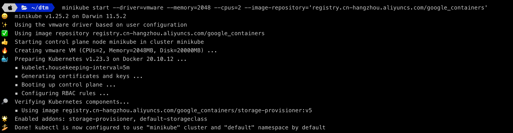
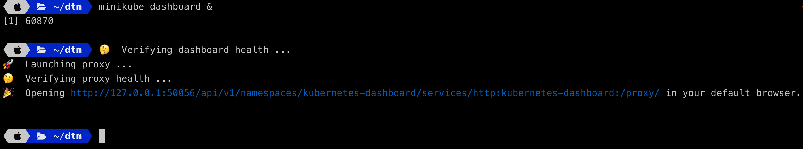
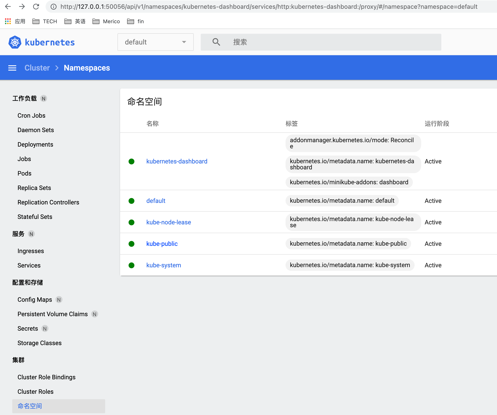
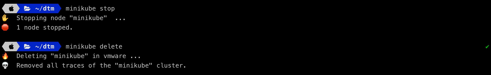
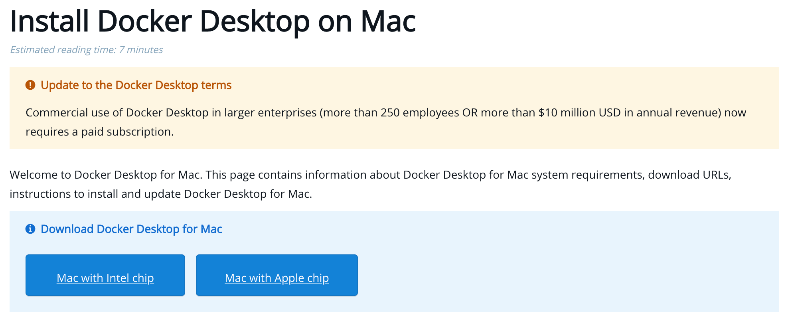
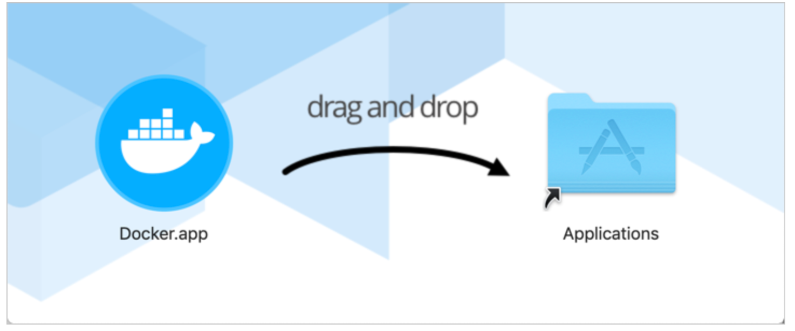
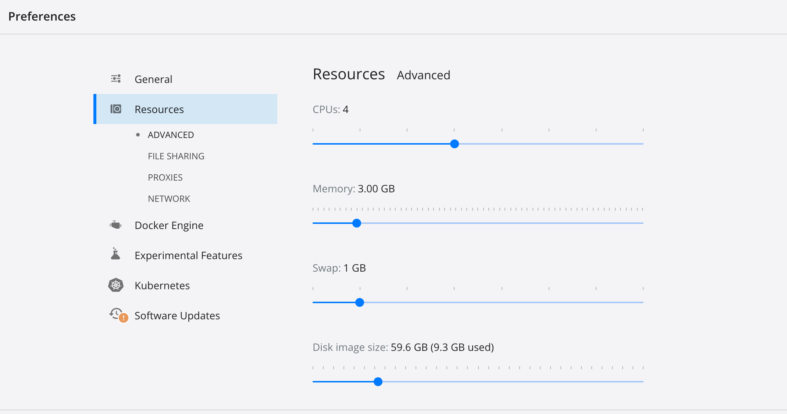
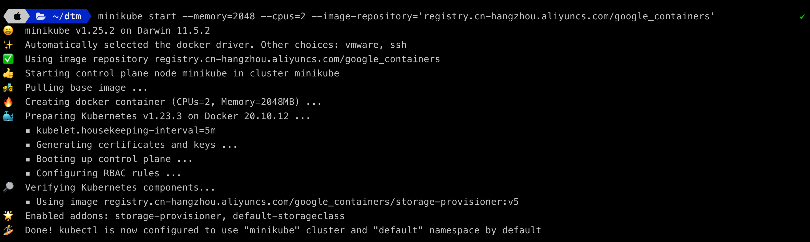
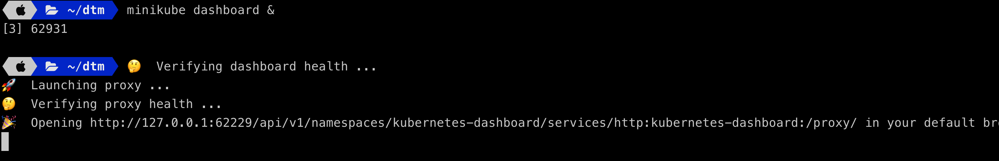
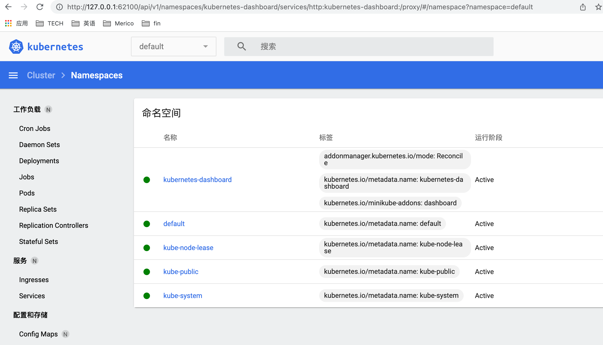

我的同事胡涛写了一篇英文的博客，关于如何使用minikube搭建本地的k8s环境的。

我很喜欢这篇文章，链接在这里：[minikube-k8s](../getting-started-with-minikube)。

该文章和本文并不是一对一的翻译的。有各自不同的角度去讲述，建议你去阅读一下该篇文章，会有不一样的收获。

> **相关背景**： 在日常开发测试中，我们验证和k8s有关的功能的时候，并不需要生产环境规格的k8s集群。
>
> 比如(3 master+3 node)，这种规格的集群，我们个人一般不具有这种配置，也没有必要为了本地测试开发的验证而去专门搭建这样的集群（除非有特殊需要）。
>
> 本文则介绍一种利用minikube来搭建k8s本地开发测试环境的方法。
> 本文是在MacOS并且是Intel芯片的机器上进行安装minikube的。
>
> **并且在安装中，指定了阿里云镜像，无须进行特别的上网方式的设置，不会有gcr.io下载慢或者无法下载而必须使用一些特殊的上网设置方法的问题。且由于镜像在国内，下载速度也很快。**

> **概要**：本文讲述了在MacOS Intel机器上：
>
> 使用minikube分别以vmware作为driver和使用docker作为driver来安装one node的k8s。

## minikube安装准备

工欲善其事，必先利其器。我们先来下载minikube:

```shell
brew install minikube
```

> 如果你的Mac上没有安装brew，请参考：[Homebrew官网](https://brew.sh/)进行安装。

接下来，我们还要下载kubectl:

```shell
brew install kubectl
```

在MacOS(intel芯片）上，minikube支持多种不同的driver：
- Docker
- VirtualBox
- VMWare Fusion
- HyperKit

接下来，我们会采用两种安装方式：一种使用VM: Vmware Fusion， 另外还有Docker两种方式来进行。

### 使用VMWare Fusion安装

在此之前，需要先在MacOS上安装好VMWare Fusion，安装的步骤也比较简单，遵从Vmware的文档来就可以，请参照：[vmware-mac-downloads](https://www.vmware.com/products/fusion/fusion-evaluation.html).

安装好Vmware之后，需要设置path:

根据你使用的是zsh还是bash，分别在.zshrc或者.bashrc里加上：(否则，进行下面的minikube start的时候，会报错，提示找不到vmware)。

```shell
export PATH=$PATH:"/Applications/Vware Fusion.app/Contents/Library"
```

当你在Vmware里安装了某个虚拟机，运行`vmrun list`命令会看到类似下面这样的输出。

其中，下面的输出中含有minikube是我在minikube已经运行之后使用这条命令的缘故。

```shell
vmrun list
```

这条命令的输出如下：

```shell
Total running VMs: 2
/Users/kehao/.minikube/machines/minikube/minikube.vmx
/System/Volumes/Data/DigitalResources/VirtualMachine/MyCentOS7.vmwarevm/MyCentOS7.vmx
```

#### 安装和启动-vmware driver

```shell
minikube start --driver=vmware --memory=2048 --cpus=2 --image-repository='registry.cn-hangzhou.aliyuncs.com/google_containers'
```

> **特别说明**：在这里，我使用了阿里云的镜像。如果没有缺省该参数，即不指定image-repository参数的话，会默认从gcr.io去下载镜像，该地址由于一些网络原因，是会被ban掉的。
>
> 其实，也是有方法可以去gcr.io下载的，但这里就交给读者自己研究了。
>
> 但用指定阿里云的镜像的方法，会在下载速度上快很多，即使读者研究了方法去从gcr.io下载image，其速度也不是从阿里云下载可比的。
>

> 作为开发测试环境，我们希望的是快速完成搭建并使用，倒腾具体的网络下载相关的配置可以放到闲余时间研究。

很快，就会看到安装且启动完毕：


比较有趣的是，可以看到，minikube使用了很多emoji表情表示了每个安装阶段的状态。这可能也是程序员可爱的一面，在其他的技术产品上，比如github，也有很多emoji表情在使用，读者有兴趣可以自己去找找。

#### 启动dashboard

也是很简单的一条命令：

```shell
minikube dashboard &
```

> 说明：加上&是为了保持后台启动，以免关掉了执行这个命令的session导致相关进程被杀掉，也可以说防止为了保持dashboard一直运行，不得不长期开着一个session。


这条命令会自动拉起浏览器打开上图所示链接，会看到k8s的dashboard。



### 使用docker driver安装

> 在更换driver之前，把原来的minikube stop并delete掉。

嗯，还是简单的一条命令。哈哈，其实是两条啦：

```shell
minikube stop
```
```shell
minikube delete
```


在使用docker作为driver之前，要确认MacOS上已经安装好了docker desktop。

安装也很简单：

遵循这里的guide去做就OK了。[macos-docker](https://docs.docker.com/desktop/mac/install/)

在这里也去说明一下安装方法:

1. 去docker官网的链接，找到你的机器对应的安装，点击下载。
   [docker-desktop-install](https://docs.docker.com/desktop/mac/install/)



2. 之后，就和安装其他的MacOS软件一样，都是拖拽安装的。



>如果有喜欢命令行安装的朋友，可以看这个链接 [install-docker-desktop-from-command-line](https://docs.docker.com/desktop/mac/install/#install-from-the-command-line)

安装完成之后，就可以启动docker desktop。

> Tips: 如果Mac配置不高，比如我的Mac，买的比较早一些，可以在启动docker desktop之前，设置docker desktop里的内存小一点。

修改docker desktop的内存的步骤：在MAC右上角的状态栏找到docker desktop->Preferences->按需修改内存和CPU的设置。



3. 启动了docker desktop之后，就可以用docker driver的方式用minikube来安装k8s了。

也很简单，就是一条命令：）

```shell
minikube start --memory=2048 --cpus=2 --image-repository='registry.cn-hangzhou.aliyuncs.com/google_containers'
```



同使用vmware driver一样，我们start完成之后，需要启动dashboard。



同样也会自动拉起浏览器打开dashboard的url。



## 查看k8s

这就和普通的k8s没什么两样了, 使用相应的命令查看即可。

>我在使用下面的命令获取k8s的nodes的时，运行的环境上只有minikube，你运行的结果视你自己的环境，可能与下面的运行结果有所不同（可能不止一个node）

```shell
kubectl get nodes
NAME       STATUS   ROLES                  AGE   VERSION
minikube   Ready    control-plane,master   15m   v1.23.3
```

### 其他的driver的安装支持

在MacOS的darwin amd64（即intel芯片）上，还支持VirtualBox作为driver以及HyperKit作为driver。

稍微需要注意的则是传参的时候，应该分别指定为`--driver=virtualbox`和`--driver=hyperkit`，而不是用这两者的驼峰命名。

至于这两者对应的虚拟机的安装，读者可以自己尝试去安装并完成整个流程，自己动手去尝试。

