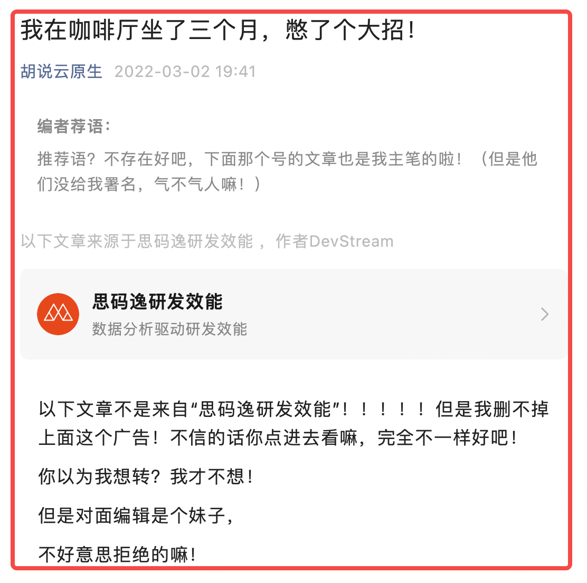


本文首发于公众号：胡说云原生

[本文原始链接](https://mp.weixin.qq.com/s?__biz=MzIxNDgwNjQ0Mg==&mid=2247484176&idx=1&sn=b7792731cfe6080c68062e00b17892c1&chksm=97a0b9d5a0d730c357c41f99e34ec9b07a9329d5ef8d9620f5f67b95656d90bb5084616a0a79&token=664063406&lang=zh_CN#rd)


> 背景信息：公司的公众号里发了一篇文章，其实内容是我主笔的。但是编辑没有给我署名。
> 我在自己的公众号里转发了那篇文章，但是“改的面目全非”。公众号的开头会标记我的文章是从“思码逸研发效能”转发的，就像这样：

## 然后咱聊聊发生了啥

- 三个月前我和老板说：我有想法！我脑子聪明！（下次和大家分享怎么当着比自己牛x的人面吹牛还不脸红）
- 老板说：那你来吧！
- 我说：创造性的工作需要自由安逸的时光！
- 老板说：那你在家呆着吧，想干啥干啥，但是钱还是会按时打到你卡里！
- 我说：家里没咖啡！
- 老板说：一个月500够不够？

然后我就去咖啡厅装土豪，甩了500在吧台上：

记住我，今天我要一杯温热拿铁不加糖，明天也是，接着每天都是，别问我第二遍！

然后我就每天去咖啡厅，给固定的前台小姐姐抛一个眼神，然后坐在窗边固定的位置等我的拿铁。含一口咖啡，开始思考：怎么做一个“好玩”的工具……

三个月啦，该 release 一个版本啦！我做的这个东西叫做 DevStream，是用来管理开源 DevOps 工具链的！（当然不是我一个人开发的，还是得强调一下，不然晚点要被内部批斗的）



**本文完**

本文真的完了。我就写了这么点。下面的内容转自那个公众号，也就是“思码逸研发效能”。当然，内容基本还是我写的，就是排版啥的被改了。



## 彩蛋

下面内容可以不看，现在我希望你直接转到 GitHub 然后找到 merico-dev/stream 项目，给我点一个 star(老板说一个star换一块钱，我可以分你0.5元)

其实他们写了另外一个很正式的版本，非常专业，还发我看了。但是我没看，那是软文，是广告，骗不到我！

今天他们都以为“公司主导的一个开源软件 release 第一个版本了”，在各个渠道宣传。但是于我而言，这是我以“核心开发者之一”的身份参与的第一个开源项目，所以我不管他们是怎么想的，反正 DevStream 就是我的一个 baby，我会在这个项目上倾注我全部的“馊主意”，把它做大做强做好用。

当然如果你发现 DevStream 有什么 bug，那你提一个 issue 试试？你看你的 issue 有本事过夜不？

下面内容是从上面那个号转发的，不过内容还是出自我的手。你看这文风就知道了，是不是很“不正式”。当然还是可以看看，毕竟还是我写的。（但是被微调过，插了几句话。你感觉看着不对劲的地方那就肯定是小编妹子自己加的。）

（我都想到了有人看完本文后会给我发私信：你不排版吗？你这么调皮你老板知道吗？）

话多，我是写代码的，不是写公众号的。我怕认真起来会被调到“商务部”去。


以下内容正式开始转自上面那个号


## 写代码以外，还有很多头疼事

假如你现在成立一家公司，或者更具体一点，你要组建一个研发团队，在开始写代码前你需要做哪些事情？
比如：
- 你需要选择一个地方来存放代码，也许是 GitHub，也许是 GitLab；
- 你需要一个工具来完成项目管理或需求管理、Issue 管理等等工作，也许你会选择 Jira 或者禅道或 Trello；
- 你需要选择一种开发语言，选择一个开发框架，比如你决定用 Golang 来开发，假如这是一个 web 项目，你需要考虑 web 框架用什么？“第一行”代码怎么写，也就是第一个脚手架怎么组装；
- 然后你需要配置一些 CI 自动化，比如 GitHub 上添加 actions 来完成代码的扫描、测试等等；
- 当然 CD 工具也不能少，不管你选择 Jenkins 还是 ArgoCD；
- 如果 CD 完成了，接下来可能你马上要开始纠结日志、监控、告警等等方案应该怎么定了
- 如果想得更多，或许你希望 GitHub 上别人给你提的 issue 能够自动同步到你的 Jira 或者 Trello……

也许上面的例子并不完全准确，但是有一个结论我们必须接受：在一个软件的开发生命周期中，除了业务代码编码本身，在 DevOps 工具链上我们需要花费大量精力去选型、打通、落地、维护。

## 一站式平台 vs 开源工具链

我们可以选择在某个云厂商手里购买一个一站式 DevOps 解决方案，只要钱够，基本就不用操心运维的问题了。

这时候你可能会遇到的最大的问题就是“灵活性”不足。云厂商大概率不会愿意为了你的定制化需求去修改“一站式 DevOps”里的任何一个环节。比如你觉得自己公司的持续集成环节特别牛，但是怎么集成进去呢？

当然“钱够”也只是一个假设，或许最大的问题是“没钱”。

我们也可以选择开源的 DevOps 工具，自己落地，搭建一条灵活的工具链，只要有足够的人力来维护（可能需要几个很资深的工程师才能玩转整条工具链）。这时候可能会遇到的最大问题就是人力和经验不足。要自己搞清楚每个环节的“最佳实践”并不是一件容易的事情。免费、灵活，但是落地难，维护难，这也不是最佳方案。

我们既想要有开源 DevOps 工具链的灵活性，可以自由组合、替换其中任意工具；也想要有一站式 DevOps PaaS 服务的便利性，不用自己投入人力物力去研究，去慢慢落地。

那么，还有第三种选择，就是一个能够“自动化管理开源 DevOps 工具链”的工具，让它来实现一个“节约人力”又“灵活高效”的 DevOps 平台。

没错，DevStream 做的就是这件事：解决开源 DevOps 工具落地的难点，搞定开源 DevOps 工具链之间打通的痛点，解放研发团队的生产力，让大家少在 DevOps 工具上踩坑，腾出更多的精力在自己的业务逻辑上。

## DevStream v0.1.0 目前能做什么？

- 缺陷、需求管理 - Trello (集成 GitHub)
- 源码管理 - Golang 脚手架生成
- CI 流程 - Golang、Python、Nodejs
- CD / GitOps - ArgoCD / ArgoCD App
- Monitoring - kube-prometheus
- ……

当然当你打开 DevStream 的 GitHub 主页时，或许会发现 v0.2.0 或者更新版本已经发布了，那么不需要犹豫，请下载体验最新版本，让历史成为历史。

## 能不能更直观一点？

👇 DevStream Demo 视频



## 你想问 DevStream 的将来？

或许用不了多久，我们就能完整实现 『DevOps toolchain as code』，届时你的整个 DevOps 工具链都能以 DevStream 作为唯一入口来运维，dtm(DevStream 命令行工具)将成为你的整条 DevOps 工具链的 『single source of truth』。当然那时你需要替换整个 DevOps 工具链中的某一个环节，也会变得很简单。

其实目前我们已经部分实现 『single source of truth』，部署好的工具发生的部分变更已经能够被 dtm 感知到，并且 dtm 会判断这种变更是否合理，是否需要修复，进而采取相应的动作让整个 DevOps 工具链变得更可靠。
怎么参与 DevStream 社区？

当然，DevStream 的发展离不开社区用户的支持，DevStream 欢迎所有人参与社区建设，一起完善 dtm 的功能，让 dtm 越来越强大！

如果您对 DevStream 项目感兴趣，点击文末『阅读全文』跳转 GitHub， README 里有更加详细的介绍。欢迎大家下载、体验、捉虫、提 Issue、挑刺、bugfix 等等等等。
