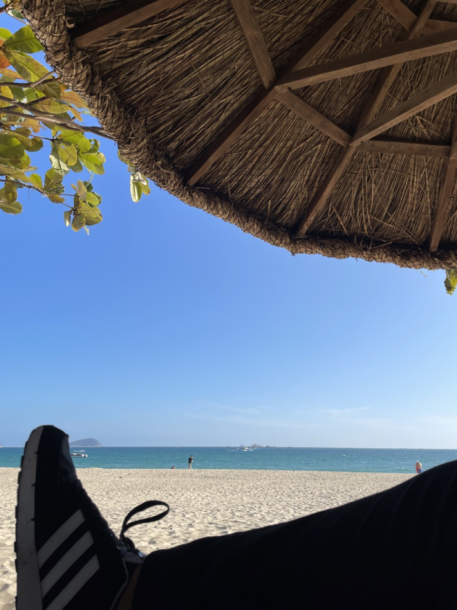
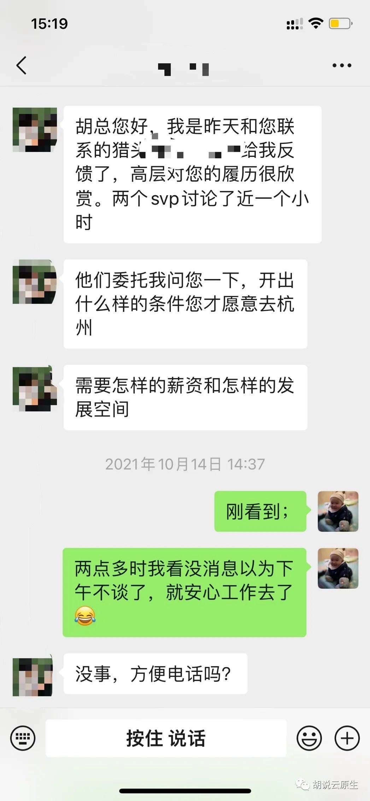
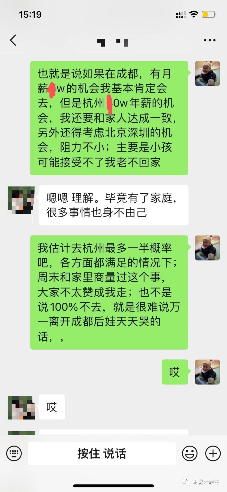
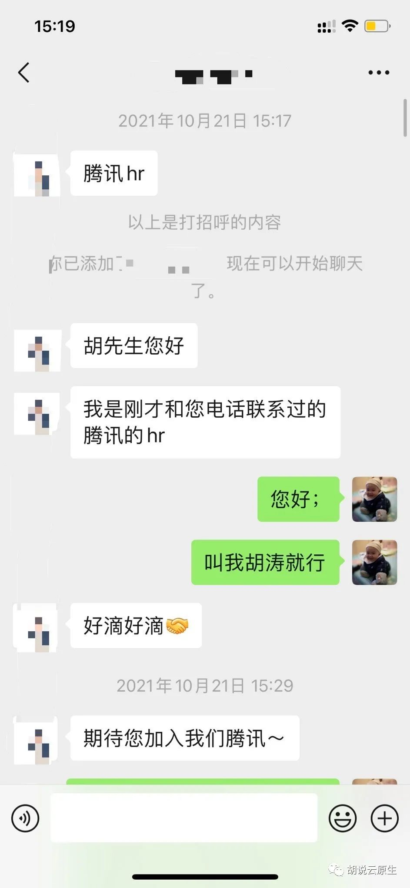

## 聊点啥？

今天是来交作业的

一个月前答应大家一件事

一个月后谈一下入职感受

 

一个月前我在群里说：

我决定去“思码逸”

那时候看到的回复大概是这样的：

 

你疯啦！

鹅厂不香吗？

千万别去创业公司！

别相信小公司的期权！

...

 

当初的选择完全是理性的
12月1日-12月31日
现在满一个月了
纯理性的视角再来看下一个月前的选择，我后悔不？

## 这个月的感受

1. 公司和我之前判断的一样，确实很精英化，能进 BAT 的不一定能进思码逸；
2. 我先后内推了4个人都挂在技术面试上。不想多说了，他们里面多半应该可以轻轻松松拿个 BAT 里的 offer 吧。哎，以后大伙也别轻易找我内推，除非你很有信心，哈哈；
3. 内部氛围很 nice，牛逼的人凑在一起沟通成本就低，不会出现“对牛弹琴”。可怕的是你会发现这些牛逼的人学习氛围还不错，大家老学习，老看书，老分享；
4. 前些天去三亚开年会了，我们全公司去海边住五星级酒店，去蜈支洲潜水，浪了好几天；去年是去大理爬苍山环洱海。说不定明年真要去夏威夷；
5. 这几天好像入职了几个实习生，都是北大的。这里清北的比例挺大，见怪不怪了；
6. 就陈述下这些小事吧，不升华了，大家自己发散～

## 我现在在干啥

**
开源项目
**

DevStream

**
一句话介绍
**

The open-source DevOps toolchain manager (DTM).

**
GitHub 地址
**

https://github.com/merico-dev/stream

我现在的主要工作就是打磨这个开源项目。不赘述细节了，感兴趣的也可以进项目主页了解详情，欢迎参与开发，和我一起搞事情，一起做出一个 CNCF 顶级项目。

## 打破寂静的第一个电话

2021年10月13日晚，一个陌生来电扰乱了我的正常工作节奏：

- **对方**：胡先生您好，我是xxx，有个工作机会想和您分享下……
- **我**：我不看新工作。
- **对方**：这是一家安全公司，但是不需要安全背景……
- **我**（就是想杠一下）：你在逗我玩吗？搞安全又不需要懂安全？
-（其实我是信息安全专业的，不过五年多以来一直在云计算行业）；
- **对方**：……（解释了很多，我也搞明白了他们不是要招“安全工程师，而是安全方向的公司要搞“云平台”建设）

最后和他聊了很多次。这家公司的发展前景还不错，离上市也很近了，规模、稳定性各方面都不错。高层也很认可我，能给带的待遇也很超预期，工作方向也很匹配。总之，工作本身我没有拒绝的理由。

中间略去很多～

我本以为钱给够了我可以去杭州。大不了每个月我飞回成都嘛，甚至半个月一次。不过真到了选择的时候，我还是不忍2岁半的儿子整个月见不到爸爸。想起自己小时候当留守儿童的几年，心理阴影是一辈子挥之不去的。

所以我又和对方说了一个条件：钱是第二位的，首先我只能在成都，哪怕经常出差也行，但是 base 地必须在成都。其次才是薪资。

最后因为 base 地没有谈拢，他们有一个副总裁认为异地办公不稳定，一个副总裁认为可以接受。我也坚决不去杭州，于是放弃了这个“太xx有钱”的工作机会。

## 各种其他公司

写到这里开始犯懒了，简单点带过吧。简单提下后面聊的五六家公司。被杭州那家公司“打扰”后我看着自己手里这点“血汗钱”肯定也就不香了，所以那之后我也随意聊了成都这边的一些公司，不过没有让我眼前一亮的。基本都是顺顺利利面试完，但是我不想去。有的是待遇给不到，有的是能给，但是待遇超过直属领导了，我知道会影响以后发展。总之没有真正特别满意的。

另外在杭州那家公司拒掉之前，我也同步看了北京深圳的机会。原因很简单，杭州可以x0万，北京深圳就有机会100万。不过在杭州拒掉之后，我也就知道了自己面对年薪百万的北京深圳机会时同样会拒绝。所以同一天也就推掉了一线城市的所有面试。

## 腾讯和华为

前面每一次面试我都很“拽”，也就是一种“爱去不去”的态度。遇到不礼貌的面试官我会直接怼过去。

比如有一家国企的技术面试，远程视频，面试官喊我开视频，我开了，然后
他说：你先做个自我介绍吧。
我说：我好像看不到你。
他说：没事，我看到你就行。
我说（你和你代表的公司在我这里面试不通过）：那就不聊了吧。

这次遇到腾讯，说实话我紧张了。因为最近几年的很多努力都是为了去腾讯做铺垫的。19年时就有机会去腾讯，但是级别会比较低。我一直想着2022年或者2023年时去腾讯要个高T。这次还没来得及自己去面腾讯，提前被勾搭了。这是为数不多让我心动的公司。

腾讯5轮面试，过关斩将，每一轮我都很认真，也是唯一一个让我面试前愿意去花时间准备的公司。

这期间也被华为勾搭了一下，“难受”的是华为明显可以比腾讯多给不少薪资。我看的很清楚，我最想去腾讯，但是最终华为一定会说：多几万你愿意来华为？然后一定有一个数字会让我愿意放弃腾讯，最终我大概率就被华为挖走了。（最想去腾讯，最终去华为，为钱所迫，不知道会是什么心情）

## 冒出个创业公司

我对“创业公司”的一贯看法就是“庙小妖风大”，“钱少屁事多”。这些年每次有猎头和我说：有个创业公司的机会想和您…… 
我会习惯性打断：抱歉，不考虑创业公司。

不过这次例外，我发现“思码逸”的门槛不低，团队小却精，领导层超级牛。于是我决定还是聊一下。

### 一面

面试官上来后和我说：你好，我是xxx，等下我会先自我介绍，然后介绍我们的公司，然后再请你自我介绍一下，接着…… 

到这里就开始和其他公司不一样了，面试官很尊重候选人，知道这不是一个单向选择。

不过最“唬”住我的还是第一句话：你好，我叫“xxx”，清华毕业的，以前在华为是19级，后来在亚马逊海外……

我最后选择思码逸的一个很重要的原因就是这个大佬。我就不明白了，你一个华为年薪几百万的大佬，又是清华的，又在欧洲亚马逊呆过，为什么会看上这家“小创业公司”？

### 二面

就一句话总结吧：公司技术栈不落后，比我想象的先进。

### CEO 面

细节不说了，反正老板还是很认可我，我也认可他。

这时候其实腾讯还在走定薪流程，但是我心里已经很确定，最后对我来说就是腾讯和思码逸二选一。于是这一天我拒掉了腾讯和思码逸外的所有机会，包括华为。

## 最后的决定

如果去腾讯，我可以在几年时间里“年薪百万”，财务自由，不再缺钱，但同时也不再有自己的生活。我的日子是早上9点出门，10点上班。晚上10点下班，11点到家，然后洗漱睡觉。我会面临巨大的压力，拧着大厂的螺丝钉。我会没有追求，除了升职加薪。我会没有精力参与孩子的童年。我会越来越虚弱，高价出卖自己的时间、健康。最终有钱了，也“镀金”了，也许三五年后能够以腾讯高T的身份再次跳到阿里字节或华为，拿着特别高的工资，继续拼命。

然后呢？

花好多年，赚好多钱，然后呢？

过的好吗？

开心吗？

我早已经饿不着、冻不着，一人赚钱全家够用。我也不追求开宾利，住别墅。不是不想，而是有钱了也不会这样做。挥霍意味着我儿子以后一定败家，然后我老年凄惨。

所以我现在其实不需要赚太多钱，够用就行了。我也不准备给儿子留下多少钱，他有自己的人生路要走。

我希望可以有一份让自己干的开心的工作。我希望我儿子有完整的充满父爱的童年。我希望这个工作可以给我带来成就感，可以发挥我的特长。我希望我可以在一个团队里举足轻重，我的“一份力”能够“很重要”。我希望我的工作能够让我当作一份事业去拼搏，有干劲，像是自己创业一样，而不是一种简单的谋生手段。

最后我答应晶磊(大家都是这样叫CEO的，对，就是喊名字)来思码逸。这时候腾讯还没定完薪，不过我已经决定了，和薪资无关。

有人告诉我创业公司的期权就像白纸一样。但是你知不知道你愿意相信这张白纸的时候，每天的工作会多开心？我会开始愿意关心自己“份外”的事情，只要这是对整个公司有利的。

我会在机场回家的路上选择坐地铁，虽然可以报销（也不是每次坐地铁，赶时间时就打车），还是想能省就省点。创业公司的快乐，就是你能够感受到自己的每一份力都“很重要”。也许在大厂里你卖命工作和整天划水完全影响不了公司的市值。而在思码逸，也许你只是一根稻草，但是保不准你会是推动公司上市的最后一根稻草。你能够发光，你会被看见，你很重要！

退一万步，你说我是不是迷信公司会上市然后我会发财？也不是。我说过我极度理性。不管未来如何，接着这几年至少我是“幸福”地工作的。“相信”本身就很“幸福”，为了“相信”而努力的过程也会很“幸福”，上市是我们努力的一种结果，但不会是我努力的目的。

再退一万步，就算创业公司就是做不起来的概率更大，但我有能力去几乎任何一家国内的大厂，并且我在持续努力，保持并提高着这种能力，何惧之有？

以前去不了一线大厂时觉得很香，老想去。这次真的有机会去了发现也就那么回事。结果不重要，这个过程收获颇丰。

---

选择无悔，幸福工作，认真生活！

